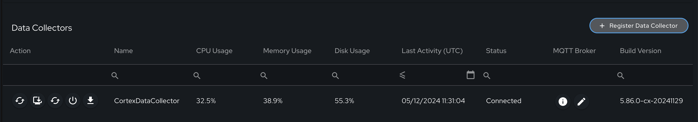
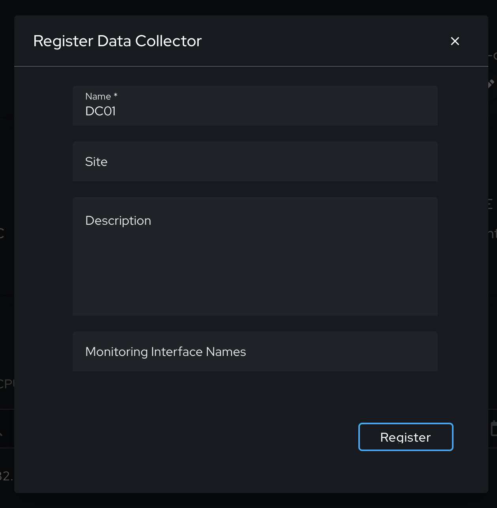
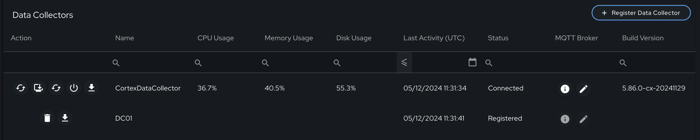

# Getting Start Guide

This getting started guide provides a step-by-step set of instructions for deploying the Exalens platform to your
system. Exalens software is installed, deployed and maintained using Docker containers for ease of setup and management, as well
providing flexibility to install the platform on bare metal hardware, virtual machines, or in the cloud

The installation process is completed via the terminal command line using the Exalens software utility binary. The binary 
for installing the Exalens Cortex is "exalens-cortex", and the binary for installing an external Exalens DC is "exalens-datacollector".

**By default, internet connectivity is required to install and use the Exalens software. To install Exalens in an air-gapped environment, please contact the Exalens team via email at team@exalens.com.**

## System Requirements

The following tables provide an overview of the minimum system requirements for installing and running the Exalens platform. 
Exact system requirements for utilising Exalens asset tracking, threat detection and response modules
will differ depending on the number of assets and average bandwidth being monitored, including whether
the types of data collection method being used.Virtualised hosts may not provide dedicated CPU, RAM and Disk resources to Exalens software during operation. 
Up to a 70% drop in Network Bandwidth ingest performance can be expected for virtualised hosts running the Exalens software depending on environment size and different virtualisation technology, hardware and network equipment configurations. 
On request, Exalens provides tailored physical appliances for customers, and customers may also deploy the Exalens platform on their bare metal hardware systems where desired to house the Exalens appliance. Note that for customer-supplied bare metal hardware, 
it is recommended that customers engage with the Exalens support team to assess the compatibility of both hardware and operating system.

For support in determining appropriate sizing for your environment contact the Exalens team via email at team@exalens.com.


### Exalens Cortex

In the table below the minimum system requirements for installing the Exalens Cortex are shown.

| **Specifications** | **Minimum (Installation Only)**       | **Minimum (Live Monitoring) **          |
|:-------------------|:--------------------------------------|:----------------------------------------|
| CPU                | 4 Cores @ 2GHz+ (x86_64 Architecture) | 8 Cores @ 2.5GHz+ (x86_64 Architecture) |
| Memory (RAM)       | 8 GB                                  | 16 GB                                   |
| Disk               | 500 GB                                | 1 TB                                    |
| Operating System   | Debian 11+, Ubuntu 20.4+              | Debian 11+, Ubuntu 20.04+               |


### Exalens Data Collector (DC)

In the table below the minimum system requirements for installing the Exalens Data Collector are shown.

| **Specifications** | **Minimum (Installation Only)**       | **Minimum (Live Monitoring) **          |
|:-------------------|:--------------------------------------|:----------------------------------------|
| CPU                | 4 Cores @ 2GHz+ (x86_64 Architecture) | 8 Cores @ 2.5GHz+ (x86_64 Architecture) |
| Memory (RAM)       | 8 GB                                  | 16 GB                                   |
| Disk               | 200 GB                                | 500 TB                                  |
| Operating System   | Debian 11+, Ubuntu 20.4+              | Debian 11+, Ubuntu 20.04+               |


### Exalens Lightweight Client Sensor (LCS)

In the table below the minimum system requirements for installing the Exalens Client Sensor are shown.

| **Specifications** | **Minimum (Installation)**            | **Minimum (Live Monitoring) **          |
|:-------------------|:--------------------------------------|:----------------------------------------|
| CPU                | 2 Cores @ 2GHz+ (x86_64 Architecture) | 2 Cores @ 2.5GHz+ (x86_64 Architecture) |
| Memory (RAM)       | 1GB                                   | 1 GB                                    |
| Disk               | 50 GB                                 | 50 GB                                   |
| Operating System   | Debian 11+, Ubuntu 20.4+              | Debian 11+, Ubuntu 20.04+               |

## Network Service Ports

The following ports are required for the Exalens Cortex, DC and LCS to communicate correctly over the network for normal operation. 
Please ensure these services are enabled in your firewall and access control policies.

### Inbound Connectivity

| **To**   | **From**                           | **Ports**          | **Description**                           |
|:---------|:-----------------------------------|:-------------------|:------------------------------------------|
| Cortex   | DC                                 | TCP 443, TCP 5379  |                                           |
| Cortex   | Admin systems                      | TCP 443, TCP 22    | Web UI Access, SSH console administration |
| DC       | SPAN / TAP interface               | All                | Passive network monitoring                |
| DC       | Netflow / IPFIX / SFlow datasource | UDP 2055           | Network flow log collection               |
| DC       | Admin systems                      | TCP 22             | SSH console administration                |
| DC       | LCS                                | TCP 9001, TCP 9999 | TCP Packet Streaming / PCAP forwarding    |
| Cortex   | External Tools                     | TCP 443            | Exalens REST API access                   |


### Outbound Connectivity

| **From** | **To**                             | **Ports**       | **Description**             |
|:---------|:-----------------------------------|:----------------|:----------------------------|
| Cortex   | All                                | TCP 443, TCP 80 | Updates and Patches         |
| Cortex   | NTP Servers                        | UDP 123         | Time synchronisation        |
| Cortex   | DNS Servers                        | UDP 53          | Hostname resolution         |
| DC       | Netflow / IPFIX / SFlow datasource | UDP 2055        | Network flow log collection |
| DC       | All                                | TCP 22          | Updates and Patches         |
| DC       | NTP                                | UDP 123         | Time synchronisation        |
| DC       | DNS                                | UDP 53          | Hostname resolution         |
| DC       | SNMP Agents                        | UDP 161         | SNMP Probe polling          |


## Using Exalens software binaries

Exalens software binaries are used for installing and maintaining various functionality Exalens Cortex, Data Collector and Lightweight Client Sensor software.
The Exalens team provide these binaries as a software package download link or compressed file - contact Exalens team@exalens.com if you require access to these binaries.

The available features of the Exalens Cortex binary "exalens-cortex" are as follows:

| **Command**        | **Description**                                            |
|:-------------------|:-----------------------------------------------------------|
| --install-docker   | Install Docker on host system                              |
| --uninstall-docker | Uninstall Docker on host system                            |
| --start            | Start Exalens Cortex software                              |
| --stop             | Stop Exalens Cortex software                               |
| --uninstall        | Uninstalls Exalens Cortex software                         |
| --update           | Update Exalens Cortex software via Docker Hub              |
| --update-offline   | Update Exalens Cortex using offline images                 | 
| --clean-install    | Perform a factory-reset install of Exalens Cortex          | 
| --backup           | Backup Exalens Cortex installation                         | 
| --restore-backup   | Restore Exalens Cortex installation                        | 
| --container-status | Show the status of running Exalens Cortex container images | 
| --netmon-config    | Set host system interfaces to passive monitoring mode      | 
| --upload-pcap      | Replay PCAP to Exalens software interface                  | 

The available features of the Exalens Data Collector binary "exalens-datacollector" are as follows:

| **Command**                     | **Description**                                                                        |
|:--------------------------------|:---------------------------------------------------------------------------------------|
| --install-docker                | Install Docker on host system                                                          |
| --uninstall-docker              | Uninstall Docker on host system                                                        |
| --download-config               | Download Exalens Data Collector configuration from Exalens Cortex                      |
| --extract-config <download_dir> | Manually extract to directory Exalens Data Collector configuration from Exalens Cortex |
| --update-hostname {hostname}    | Update the hostname of the Exalens Cortex the  Exalens Data Collector connects to      |
| --start                         | Start Exalens Data Collector software                                                  |
| --stop                          | Stop Exalens Data Collector software                                                   |
| --uninstall                     | Uninstalls Exalens Data Collector software                                             |
| --update                        | Update Exalens Collector software via Docker Hub                                       |
| --update-offline                | Update Exalens Collector using offline images                                          | 
| --clean-install                 | Perform a factory-reset install of Exalens Collector                                   | 
| --backup                        | Backup Exalens Collector installation                                                  | 
| --restore-backup                | Restore Exalens Collector installation                                                 | 
| --container-status              | Show the status of running Exalens Collector container images                          | 
| --netmon-config                 | Set host system interfaces to passive monitoring mode                                  | 
| --upload-pcap                   | Replay PCAP to Exalens software interface                                              | 

The available features of the Exalens Lightweight Client Sensor binary "exalens-client-sensor" are as follows:

| **Command** | **Description**                                 |
|:------------|:------------------------------------------------|
| --configure | Configure the Exalens Lightweight Client Sensor |
| --start     | Start the Exalens Lightweight Client Sensor     |
| --stop      | Stop the Exalens Lightweight Client Sensor      |


## Installing the Exalens Cortex software (Online Install)

To extract the installation package, follow these steps:

1. With the Exalens Cortex software package provided by Exalens (e.g., exalens-cortex.tar.gz). Use the tar command to extract the package:

    ```sh
    tar -xvf exalens-cortex.tar.gz
    ```

Expected Output: The tar command will extract the contents of the package into the current directory, displaying the Exalens software binary "exalens-cortex".

### Installing Docker
Before installing Exalens software images, Docker must first be installed on the host system. It is recommended to remove any existing Docker installation on the 
host system on order to prevent permissions conflicts. 

Removing existing Docker installations can be achieved by running the command:

```sh
./exalens-cortex --uninstall-docker
```

Install Docker using the Exalens software binary using the following command:

```sh
./exalens-cortex --install-docker
```

Once Docker is installed, you will be prompted to restart in order to ensure correct user permissions are configured for Docker. 
You must restart to ensure user permissions are correctly updated, failing to do so can result in the Exalens software failing to start correctly.

### Starting the Services
After rebooting the host, you can start the Exalens services by running the following command:

```sh
./exalens-cortex --start
```

When run for the first time, the Exalens software container images will be downloaded and extracted - note that this can take some time to complete. 
Once downloaded and extracted, the Exalens Cortex services will automatically start.


### Accessing and Setting up the Exalens Cortex
You can access the Exalens Cortex web UI by opening a web browser and navigating to the URL after the Exalens Cortex is started and the service is running.

```sh
https://[IP_ADDRESS/HOSTNAME]
```

Replace [IP_ADDRESS/HOSTNAME] with the host IP address or hostname where the Exalens service is running.


### First Login and Password Change
The user login prompt for Exalens will appear. Use the following default Exalens administrator user credentials to log in:

- **Username:** admin
- **Password:** @Dm1nadmin

You will be prompted to change your password. Please follow the instructions to set a new password.


## Updating the License (Online Install)
Once you have logged in for the first time, you will be prompted for a License Key. Enter the License Key and click the "Update License" button.
The system will validate the license is valid with Exalens licensing servers and then start loading the software. 
You can also update your license at any time via the "System Administation" page.


## Accepting the End User License Agreement (EULA)
At first login, once the license key has been validated, you will need to accept the EULA to continue loading the software. Please read the agreement and click "Accept".
After accepting the EULA, the software will continue loading system modules and configuration. 

put image here

Once the UI dashboard loads, this indicates the software has successfully loaded and is ready to use.

put image here

### Updating the Exalens Cortex (Online Update)
To update the Exalens Cortex, the following command should be used:

```sh
./exalens-cortex --update
```

Note, when updating the Exalens Cortex will be stopped. After update has completed, the Exalens Cortex must be manually restarted:

```sh
./exalens-cortex --start
```

### Factor-Reset Install of Exalens Cortex
To factory-reset the Exalens Cortex and perform a clean-install of the Exalens Cortex, running the following command:

```sh
./exalens-cortex --clean-install
```

Note a clean install will completely remove any existing Exalens Cortex installation, therefore, it is recommended to take a backup of the existing Exalens Cortex installation before proceeding with a clean install.

### Uninstalling the Exalens Cortex

To completely uninstall the Exalens Cortex from the host machine, run the following command:

```sh
./exalens-cortex --uninstall
```

Note this will not uninstall Docker. To uninstall Docker fully from the host system, run the following command:

```sh
./exalens-cortex --uninstall-docker
```

### Backing Up the Exalens Cortex Installation

Backing up the Exalens Cortex installation involves performing a directory back-up of Exalens Cortex system configuration and databases under directory ".exalens". 
Exalens container images are not saved during the back-up process as they are do not contain isolated installation data. To back up the Exalens Cortex installation, run the following command:

```sh
./exalens-cortex --backup
```

You will be prompted to provide the directory in which to save the backup, which will be saved as a compressed .tar.gz file. 
Note that the Exalens Cortex will be shutdown during back up, and must be manually restarted afterwards, using the command:

```sh
./exalens-cortex --start
```

### Restoring a backup of the Exalens Cortex Installation

To restore the Exalens Cortex from a previous backup, run the following command:

```sh
./exalens-cortex --restore-backup
```

You will be prompted to provide the full directory path and file name of the backup file, which will be decompressed and used to 
overwrite the existing Exalens Cortex installation. Note that the Exalens Cortex will be shutdown during back up, and must be manually restarted afterwards, using the command:

## Installing the Exalens Data Collector software (Online Install)

The steps for installing an external Exalens Data Collector are identical to the Exalens Cortex, with the exception that all configuration commands should used the with "exalens-datacollector" binary. 
However, there are a small number of additional, specific steps required to successfully connect an Exalens Data Collector with a Exalens Cortex, these steps are now described.

Before installing Docker and the Exalens Data Collector on the host system, the Data Collector should be first registered on a Exalens cortex, and its configuration then downloaded by the Data Collector.

### Register an external Exalens Data Collector on the Exalens Cortex

In the figure below you will see the "Register Data Collector" button under "System Administration - Data Collectors". This button should be selected to register a new Data Collector with the Exalens Cortex.



Once clicked the Data Collector Registration configuration menu will appear, as shown in the figure below. In this menu, the name of the Data Collector must be provided, whilst all other parameters remain options. However, if there are network monitoring interfaces that have already been identified on the Data Collector these may be entered during registration as well (the exact name of the interface as it appears on the host machine must be supplied).



Once the Data Collector has been registered, it will appear in the list of Data Collectors under System Administration, with the stats "Registered".



### Installing the Exalens Data Collector Docker Dependencies

Once a Data Collector has been registered on the Exalens Cortex, following the same steps as the Exalens Cortex to install Docker dependencies on the host machine.

```sh
./exalens-datacollector --install-docker
```

Once Docker is installed, you will be prompted to restart in order to ensure correct user permissions are configured for Docker. 
You must restart to ensure user permissions are correctly updated, failing to do so can result in the Exalens software failing to start correctly.

### Download an external Exalens Data Collector configuration from the Exalens Cortex

Once a Exalens Data Collector is registered with the Exalens Cortex and the Data Collector host machine has been rebooted following installation of the Docker dependencies, its configuration needs to be downloaded before the Exalens Data Collector can be started and connected to the Exalens Cortex. 
To download the Exalens Data Collector, run the following command:

```sh
./exalens-datacollector --download-config
```

You will be prompted then be prompted the following information:
1. IP / Hostname of the Exalens Cortex
2. The **exact** name of the Exalens Data Collector as it appears on under "System Administration" on the Exalens Cortex
3. The username and password of an Administrator account on the Exalens Cortex.

Once these details are entered correctly, the Exalens Data Collector will pull down, extract and store its configuration from the Exalens Cortex.

### Start and connect an external Exalens Data Collector with the Exalens Cortex

```sh
./exalens-datacollector --start
```

You can start the Exalens services by running the following command:

```sh
./exalens-datacollector --start
```

When run for the first time, the Exalens software container images will be downloaded and extracted - note that this can take some time to complete. 
Once downloaded and extracted, the Exalens Cortex services will automatically start.

Once successfully started, the Data Collector under System Administration status should change to "Connected", with connectivity and resource metrics visible.

If after starting the Exalens Data Collector the status remains as "Registered", double check that the correct Data Collector name has been supplied when running the "--download-config" command. If the status is not "Registered" or "Connected", double check network connectivity between the Exalens Data Collector and Exalens Cortex is working as expected and that there are not firewall rules blocks connecitivty from the Data Collector to Cortex on TCP ports 443 and 5379.


