# Asset Intelligence

## Introduction

This guide provides an overview of Exalens asset discovery, tracking and profiling intelligence features. Within Exalens, assets are discovered, tracked and profiled automatically via network logs received from network monitoring (e.g., TAP, SPAN, PCAP input into a Data Collector monitoring interface). Unlike other tools that provide similar functionality, it is not necessary for users to manually configure the asset discovery and profiling feature as this is taken care of by Exalens Cortex Asset Management Engine automatically. Once network monitoring is configured, the Asset Management Engine will activate and automatically track and profile an asset to identify and record key asset intelligence and information details. Once activated, assets are typically discovered in real-time, whereas asset profiling updates occur within a 5-minute interval; therefore, it can take up to 5 minutes for asset profile information to be updated with new asset intelligence. The Asset Management Engine tracks assets dynamically even when their IP address, MAC Address, or Hostname changes, so that these changes are recorded for the asset over time.

## Asset Views

**Table View**: This view provides a summarised table view of all assets that the Asset Management Engine is currently tracking and profiling. Note that by default, external assets with public IP addresses are not discovered or tracked by the system. In this view, users can search and filter for assets based on their unique, system-assigned Asset ID, Last Seen Timestamp, IP Address, Hostname, Asset Category, Asset, Type, MAC Address, MAC Vendor, Device Vendor, Operating System and Firmware. On clicking on an asset in the table view, users will be automatically redirected to the asset's "Asset Info" page, which provides detailed information for that asset.

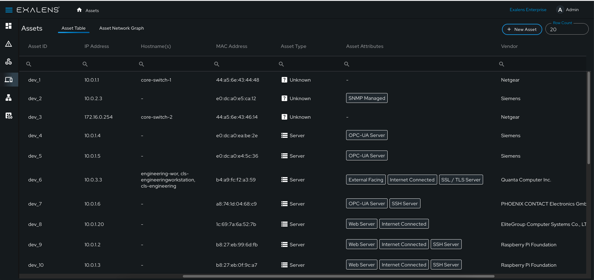

**Network Graph View**: This view provides a network graph visualisation of all assets that the Asset Management Engine is currently tracking and profiling. Unlike the table view, this view visualises the network connectivity that has been observed between assets in a topological graph. The network graph view is useful for gaining a high-level overview of how devices are communicating, and pinpointing what network connectivity paths are possible in the network. The network graph represents IP connectivity only, and not physical connectivity between assets, therefore, intermediary network devices facilitating communication between assets may not be visible or shown in the network graph. Assets in the graph that have no connectivity links are assets that have been discovered, but no inbound or outbound connectivity to another asset has been observed by the Asset Management Engine.

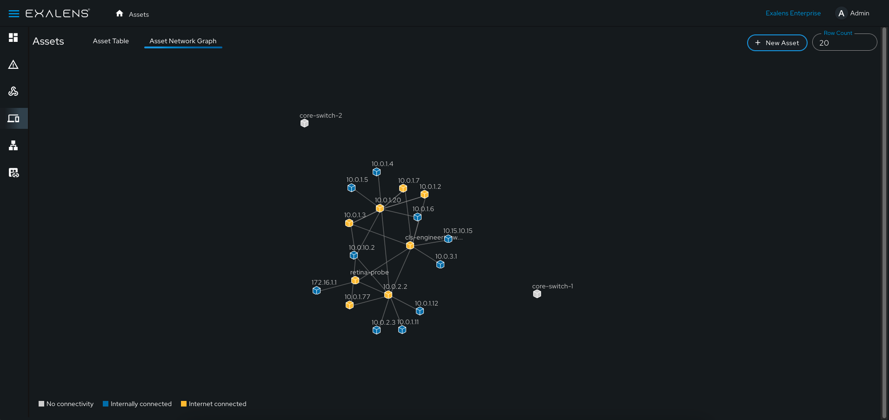

## Asset Info View

When an asset is selected in the Table or Network Graph view, the user is redirected to the Asset Info view for that asset. The Asset Info view is a detailed asset intelligence summary containing information that has been discovered, profiled and tracked for the asset. 

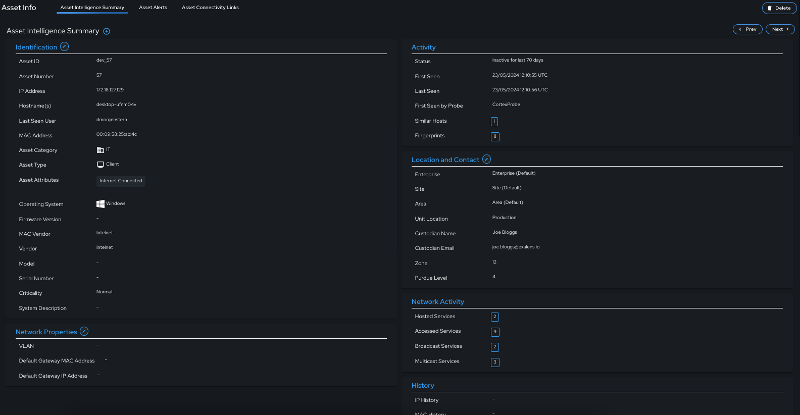

### Identification

Asset "Identification" information contains profiled identity information extracted for network logs and datasource variables for asset. Each of "Identification" field can be automatically or manually updated, exception for Asset ID and Asset number which are system generated values that are not editable after asset creation. 

|**Field**|**Description**|
|:--|:--|
|Asset ID|Unique ID of the asset|
|Asset Number|Incremental number assigned to asset at creation|
|IP Address|Current IP Address of the asset|
|Hostnames(s)|Hostnames observed to be used by the asset|
|Last Seen User|The last seen username seen in use on the asset|
|MAC Address|The current MAC address of the asset|
|Asset Category|The category group of the asset|
|Asset Type|The asset type with respective to client/server role|
|Asset Attributes|Profiling attributes assigned to the asset|
|Operating System|The operating system running on the asset|
|Firmware|The firmware running on the asset|
|MAC Vendor|The vendor of the asset MAC address|
|Vendor|The vendor of the asset system|
|Model|The model of the asset system|
|Serial Number|The serial number of the asset system|
|Criticality|The asset criticality|
|System Description|The asset generated  or manually added system description |

#### Asset Category 

Asset Category refers to whether an asset is categorised with specific high-level family grouping of asset types with respective network domain.

|**Asset Category**|**Description**|
|:--|:--|
|IT| The asset has been categorised as a common IT system |
| OT/ICS | The asset has been categorised as a OT / ICS system |
| Network Equipment| The asset has been categorised as Network Equipment |

#### Asset Type

Asset Type refers to whether a particular asset is performing a client or server role in the network.

|**Asset Type**|**Description**|
|:--|:--|
|Unknown| Currently it cannot determined whether the asset is acting as a client or server in the network |
| Client | The asset is acting as a client in the network |
| Server | The asset is acting as a server in the network |

#### Asset Attributes

Asset attributes are detailed role profile labels assigned assets. Unlike asset category or type, an asset can have one or more attributes, that provides low-level context or the deive role, criticality and constraints in the network. Some attributes can be used to control what type of information is profiled for an asset, whilst other attributes will influence the criticality of an asset (e.g., "Domain Controller" or "PLC" attributes would immediately set an asset's criticality label to "Critical"). There are fix set of attributes that will be automatically assigned to an asset during profiling, with some attributes only assigned manually. Users can add their own custom attributes if desired, however, these may be lost if the software is reinstalled without backup. In the table below a list of available Asset Attributes are provided (note `{Application Server}` refers to an attribute applied for a specific application protocol that the asset is serving over the network e.g., NTP Server, DHCP Server, Syslog Server, etc.):

|**Asset Attributes**|**Assigment**|
|:--|:--|
| Web Server| It is unknown whether the asset is acting as a client or server in the network |
| Email Server | Automatic |
| File Server | Automatic |
| DNS Server|Automatic|
|HTTP Proxy |Automatic|
|Proxy Server|Automatic|
|Authentication Server|Automatic|
|Domain Controller|Automatic|
|Database Server|Automatic|
|VPN Server|Automatic|
|Router / L3 Switch|Automatic|
|Wireless AP|Automatic|
|Switch|Automatic|
|Wireless Router|Automatic|
|Remote Desktop Server|Automatic|
|HMI|Automatic|
|PLC|Automatic|
|IoT Sensor|Automatic|
|Sensor|Manual|
|Actuator|Manual|
|DCS Server|Manual|
|Network Management Server|Automatic|
|Virtual Machine|Automatic|
|Container|Automatic|
|RTU|Manual|
|MTU|Manual|
|RTU|Manual|
|VFD|Manual|
|IED|Manual|
|PCS|Manual|
|SIS|Manual|
|IRC|Manual|
|ERP Server|Manual|
|Remote Access Server|Automatic|
|I/O Server|Manual|
|MES|Manual|
|IP Camera|Manual|
|CnC Machine|Manual|
|Load Balancer|Manual|
|Application Server|Manual|
|Backup Server|Manual|
|Tablet|Manual|
|Smartphone|Manual|
|iPhone/iPad|Manual|
|SCADA Server|Manual|
|Engineering Workstation|Manual|
|Data Historian|Manual|
|Robot Controller|Manual|
|Smartwatch|Manual|
|Smart TV|Manual|
|Drone|Manual|
|Mobile Robot|Manual|
|Printer|Manual|
|3D Printing Machine|Manual|
|WSUS Server|Automatic|
|Application Server|Manual|
|Update Server|Manual|
|IO-Link Master|Manual|
|IO-Link Slave|Manual|
|Firewall|Manual|
|IDS|Manual|
|IPS|Manual| 
|IP Radio Controller|Manual|
|Ground Controller|Manual|
|Traffic Controller|Manual|
|IP Radio|Manual|
|IoT Device|Manual|
|Network Diode|Manual|
|Protocol Gateway|Manual|
|MQTT Broker|Manual|
|Autonomous Vehicle|Manual|
|External Facing|Automatic|
|Internet Connected|Automatic|
|New Device |Automatic|
|ROS1 Client|Manual|
|IP KVM|Manual|
|IP Phone|Manual|
|Mainframe|Manual|
|Workstation|Manual|
|Laptop|Manual|
|Raspberry PI|Automatic|
|Medical Device|Manual|
|Pendant|Manual|
|Network Attached Storage|Manual|
|OS Manually Set|Manual|
|Criticality Manually Set|Manual|

### Activity

Activity refers to unique tracking information for this asset, such as when the asset was first and last seen and by which DC, assets that were identified to be acting similar to this, as well as unique fingerprints that only this asset generates on the network.

|**Field**|**Description**|
|:--|:--|
|Status|"Active" / "Inactive" status of the asset - if the Last Seen > 7 days, an asset is determined to be "Inactive"|
|First Seen|Time when the asset was first seen|
|Last Seen|Time when the asset was last seen|
|First Seen by Probe|When the asset was first seen by the DC|
|Similar Hosts|Assets that have been assessed via similarity and clustering analysis to be similar to the asset|
|Fingerprints|Network application meta-data / payload fingerprints that are unique to this host in the network (e.g., user agent, client JA3, digital signature, SSH Client string, etc.)

#### Similar Hosts

Similar hosts refers to other assets tracked and profiled by the Asset Management Engine that have been assessed as being similar peer group assets to this asset. Similar hosts are identified via the Asset Management Engine's unsupervised learning by grouping assets together based on similarities between "Identification", "Activity", "Network Activity", and "Network Properties" information. Similar hosts are used by the Exalens platform to assess how notable an asset's incidents alerts are when compared to similar incident alerts seen for similar hosts.

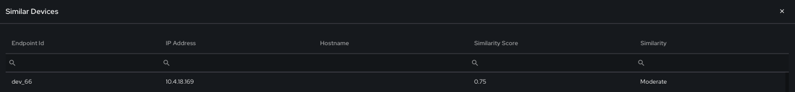

#### Fingerprints

Fingerprints are unique network application meta-data / payloads that the asset generates on the network. As unique fingerprints they provide a means to reliably track asset activity across the network even if the asset changes IP addresses, Hostnames or MAC Addresses. They also provide useful indicators of compromise for threat hunting.

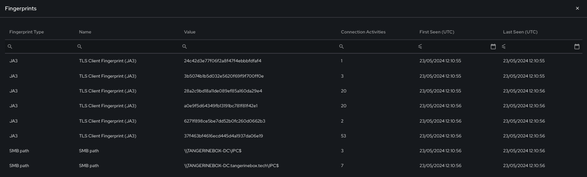

### Location and Contact

Location and Contact asset details are manually added by users to provide physical and logical enterprise location and ownership information. Allowing the asset to be tracked effectively across the Enterprise.

|**Field**|**Description**|
|:--|:--|
|Enterprise|Enterprise to which the asset belongs|
|Site|Site location of the asset|
|Area|Area location of the asset|
|Zone|Zone location of the asset|
|Unit Location|Exact unit location of the asset|
|Custodian Name|Name of the asset custodian|
|Custodian Email|Email address of the asset custodian|
|Purdue Level|The logical level categorisation of the asset in the Purdue Framework (may be auto-assigned based on specific asset category / attribute assignments|

### Network Properties

Network Properties refers to the assets network connectivity at Layer 2 and Layer 3 in the network. For Layer 2, connectivity profile to an wired/wireless access point or switch is identified via VLAN and MAC Address, whereas, for Layer 3, connectivity is identified by the default gateway IP address of the connected Layer 3 switch / router the asset is connected to.

|**Field**|**Description**|
|:--|:--|
|VLAN|The current VLAN the asset is using for communication over the network - if seen in network logs the VLAN value is auto-assigned.|
|Default Gateway MAC Address|The current Layer 2 network gateway the asset is using for communication over the network - if seen in network logs the MAC Address is auto-assigned.|
|Default Gateway IP Address|The current Layer 3 network gateway the asset is using for communication over the network - if seen in network logs the IP Address is auto-assigned.|

### Network Activity

Network activity refers to the tracked network communication this asset is producing on the network for inbound and outbound connections to internal, external hosts as well as broadcast and multicast services.

|**Field**|**Description**|
|:--|:--|
|Accessed Services|Internal and External IP addresses that the asset has accessed on specific network service protocols and ports|
|Hosted Services|Internal and External IP addresses that have accessed the asset on specific network service protocols and ports|
|Broadcast Services|Broadcast addresses the asset has contacted on specific network service protocols and ports|
|Multicast Services|Multicast addresses the asset has contacted on specific network service protocols and ports|

Network Activity provided a simplified, but rich view of asset activity on the network over time which allows users to easily drilldown in to specific services and servers the asset has accessed, or what services the asset is hosting and who are its clients.

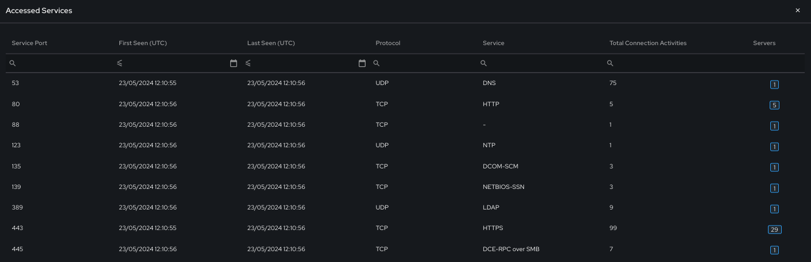

In the example below, the previous accessed service for HTTPS (on port 443) have been drilled downt to observe specific servers the asset accessed on this service.

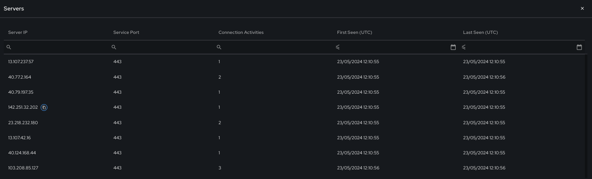

### History

History refers to specific asset information that is dynamically tracked and update when an asset changes key identifiable information in the network, such as IP Address, VLAN, MAC Address, and Usernames. History provides a archive record of this information if and when it changes for the asset.

|**Field**|**Description**|
|:--|:--|
|IP History|List of IP Addresses previous seen for this asset on the network|
|VLAN History|List of VLAN IDs previous seen for this asset on the network|
|MAC History|List of MAC Addresses previous seen for this asset on the network|
|Username History|List of usernames previous seen for this asset on the network|

## Adding/Updating/Deleting Assets via the Cortex UI

Assets can be easily manually added, updated and deleted via the Exalens Cortex UI. This achieved by first creating an asset via the table view, selecting the "New Asset" button in the far right of the UI. Here, basic information for the asset is provided such as IP Address, Hostname, Enterprise, Site and Area. 

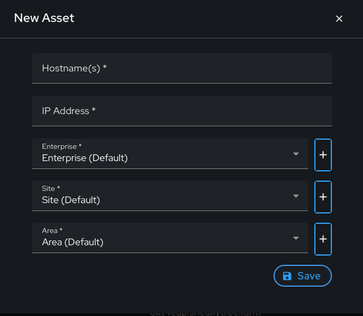

Once an asset is added the Asset Management Engine will automatically begin tracking and profiling it. However, users can also manually update any information under the "Asset Info" view for the asset, wherever the "pen" icon is shown. See below example for manual updating of "Identification" information.

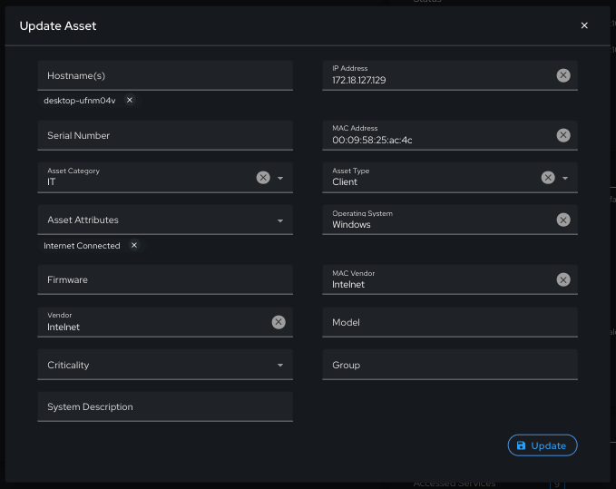

Assets can also be deleted either via the "Asset Info" view by selected "Delete Asset" button in the far right corner of the UI. Note that an asset may be recreated if by the Asset Management Engine if it is active on the network. 

## Adding/Updating/Deleting Assets via the App API

Assets can be manually added, updated and deleted on the Exalens Cortex via the App API - see [App API](./app_api.md) for more details on how to use the /asset REST endpoint.

## Asset Alerts

The "Asset Alerts" tab provides a summary of all current open incident alerts for the asset. Here, users can selected an alert and be redirected to the incident alert analysis page.

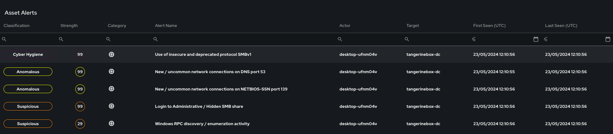

## Asset Connectivity Links

The "Asset Alerts" tab provides a summary of all connections the asset has made to internal and external hosts for a specific time period. The connectivity links displayed can be customised by adjusting the "Connections Type" option to show all hosts, internal or external host only, and by adjusting the time picker period.

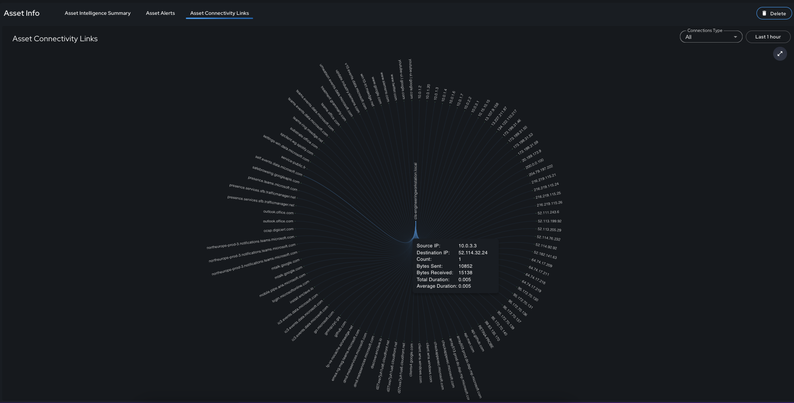

