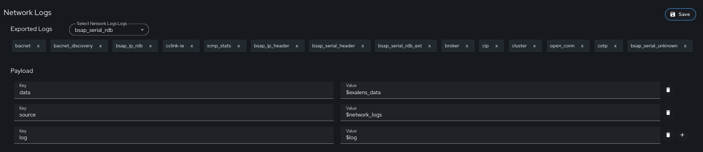
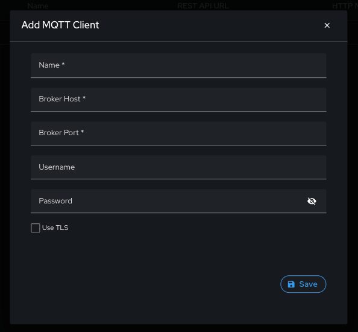
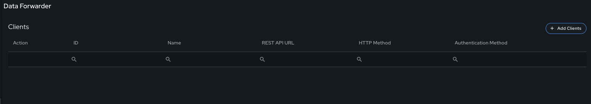
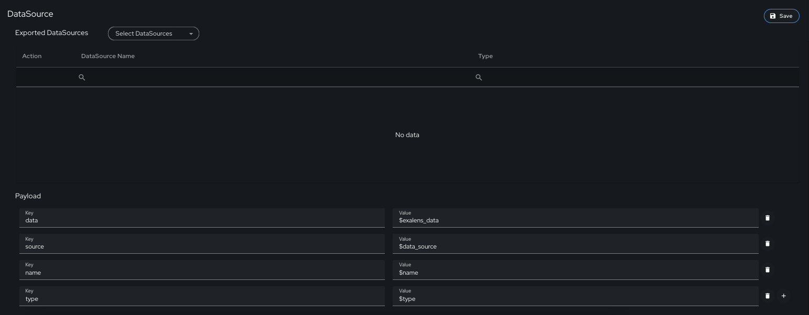
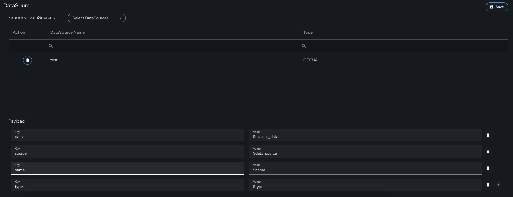
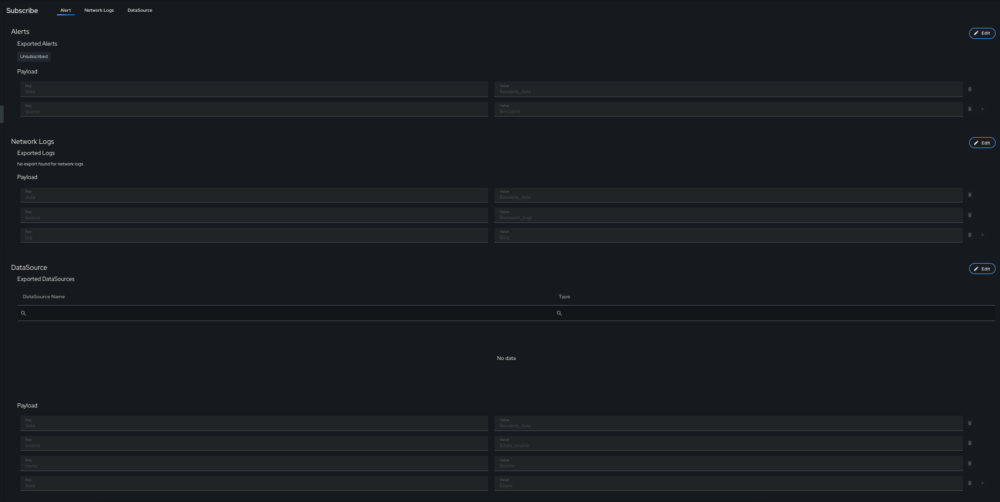
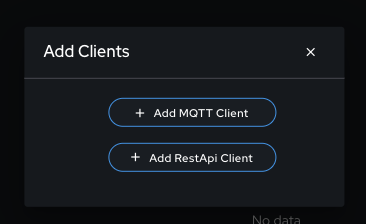

# Data Forwarding

In the Exalens platform it is possible to setup data forwarding of incident alerts, network logs, and datasource logs to external systems via MQTT or HTTP/HTTPS REST API clients. 

