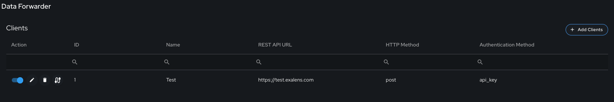
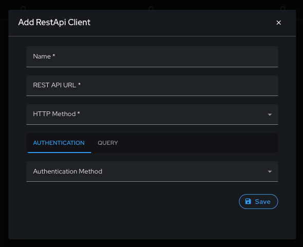
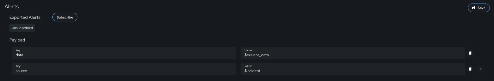

# Data Forwarding

## Introduction

This guide provides an overview of Exalens Data Forwarding feature. In the Exalens platform it is possible to setup data forwarding of incident alerts to external systems via HTTP/HTTPS REST API clients. 

## Adding a Data Forwarding Client

To add a data forwarding client, select "Add Clients" under the Data Forwarding menu. 

**Important**: Exalens Data Forwarding clients are highly configurable to support any HTTP REST API authentication method, and provided a basic skeleton that will ensure compatibility with any target system as long the target system API supports JSON data payloads.

Selecting the RestAPi Client option results in a configuration pop-up where the name, URL and HTTP method parameters should be supplied.
Available authentication options are token bearer or API key, with respective configuration parameters presented once the authentication method has been selected.

Once a data forwarding client has been configured, alert forwarding can be enabled, with customised options in the JSON payload that is sent to the target system.
As shown in the below figure, by selecting the "subscribe" button and the selecting the "save" button, Exalens alerts will be forwarded to the target data forwarding client system based on the defined payload configuration.

The payload configuration is completely customisable and thus allows for adjustment to support the format expected by a target system API when forwarding alerts from the Exalens Cortex.

In the video link below, a step-by-step example is provided showing the creation of a HTTP(S) data forwarding client sending logs to a Splunk HTTP Event Collector (HEC) in a Splunk Enterprise server.

