# How to Create a MQTT DataSource Client

This guide provides step-by-step instructions on how to create a data source client using the Exalens platform. The client will connect to a MQTT Broker to collect and store data, which can then be visualized using table and chart views.

## Short Video Guide

See below for detailed instructions.

## Connect

### Create a New Data Source

On the Exalens dashboard, navigate to the "Datasources" section.

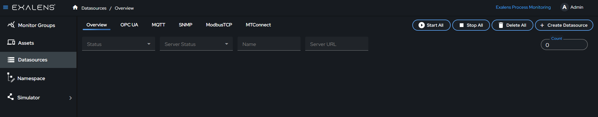

Click on the "Create Datasource" button.

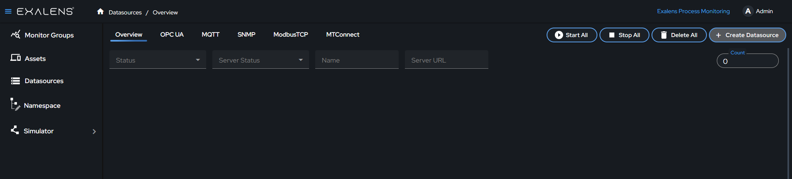

### Select MQTT

A dialog box titled "Select Datasource" will appear. Choose "MQTT Broker" from the list of available options.

### Configure the MQTT Broker Connection

Fill in the details for the MQTT Broker in the provided fields:
- **Name:** Enter a descriptive name for the data source.
- **Broker Host:** Input the Broker Host. This is the address of the server. Use "localhost" if the server is on the same machine you are working on. Replace it with the actual IP address if the server is on a different machine.
- **Broker Port:** Input the port number. Ensure this port is open and accessible. 
- **Topics:** Provide MQTT Broker Topics. Default will be # & $SYS/#. Suggesting to remove " # " , as it loads varibles from all the topics and enter the required topics. 

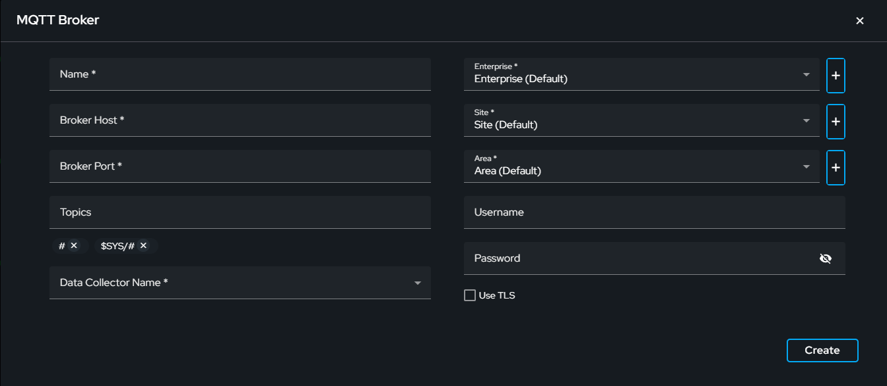

### Data Collector Name

Selecting the correct Data Collector is crucial. Ensure you choose a Data Collector that has network access to the MQTT Broker. The client runs on the Data Collector, establishing the connection with the MQTT Broker. All installed Data Collectors will be listed in the dropdown menu.

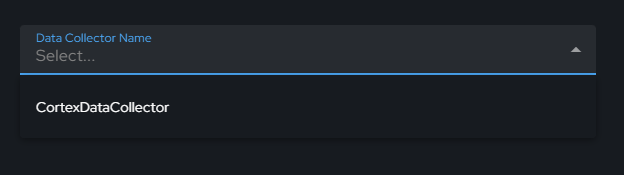

### Authentication Methods

**Anonymous**
- Use "Anonymous" authentication method, without providing user credentials.

**User Authentication**
- Provide User credentials and "Create".

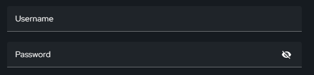

**Certificate and Key**
- Check "Use TLS" and "Require TLS Client Authentication"
- Prompt will appear for a client certificate and a private key file.
- Click "Browse" to upload the client certificate file (allowed format: .crt).
- Click "Browse" to upload the private key file (allowed format: .key).
- Click "Verify TLS Certificate" option (If not using self signed certificate) and upload the  CA certificate file (allowed format: .crt / .pem)
- Click "Create" to complete the process.

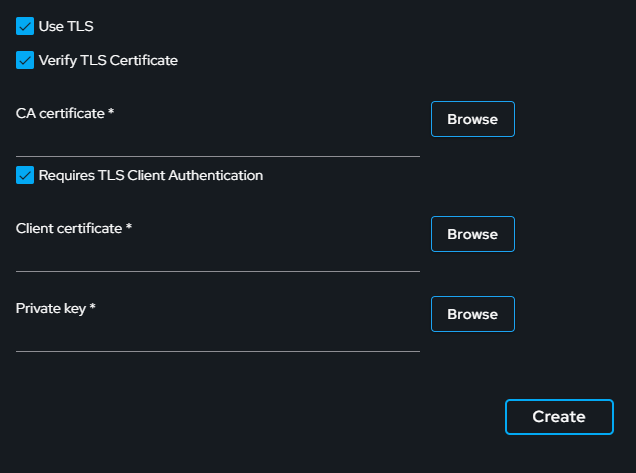

### Create the Data Source

After configuring the server connection details, click the "Create" button. This action establishes a persistent client connection with the MQTT Broker. A confirmation message will appear indicating a successful connection. If the connection fails, verify your broker host & broker port number, authentication details, and network settings, then try again.

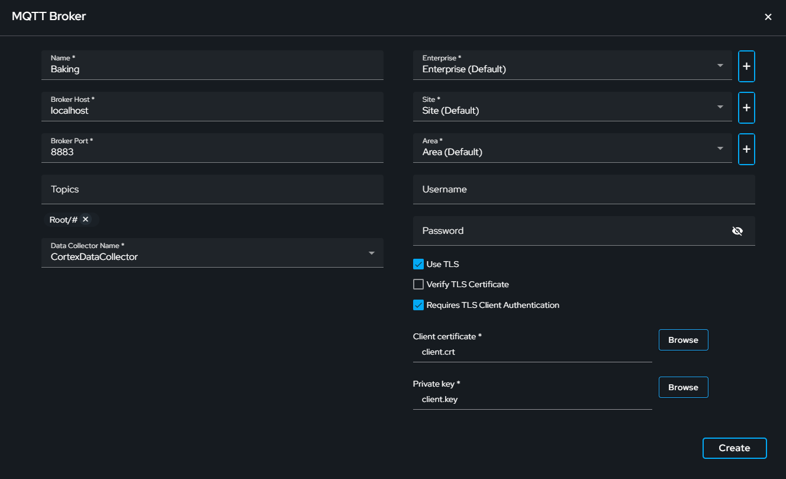

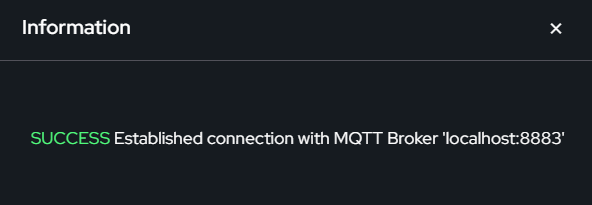

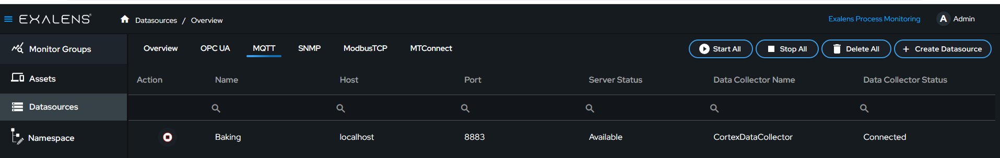

## Collect and Store

After the data source client is created, click on the data source client. Click on "Configure" to open the MQTT folder structure. Browse through the server folders, select the variables you want to subscribe to, and drag them into the subscription list area. Click on "Save Subscription." Upon successful subscription, you will be taken to the live view where you can monitor the live data. The data collected from these subscriptions will be stored in a time series database for further analysis and historical reference.

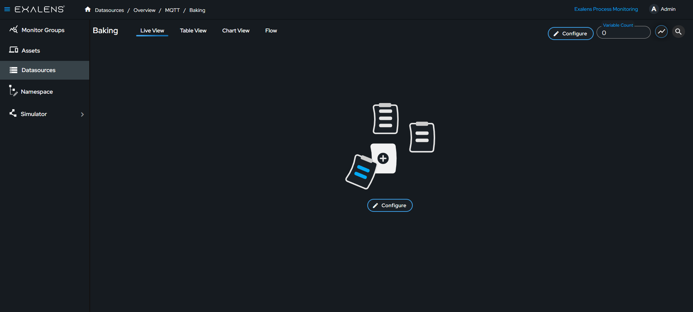

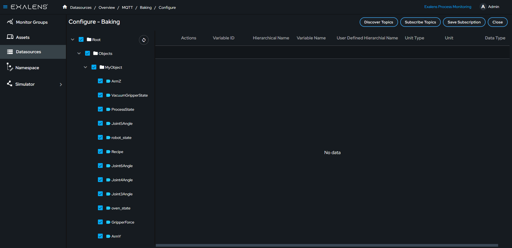

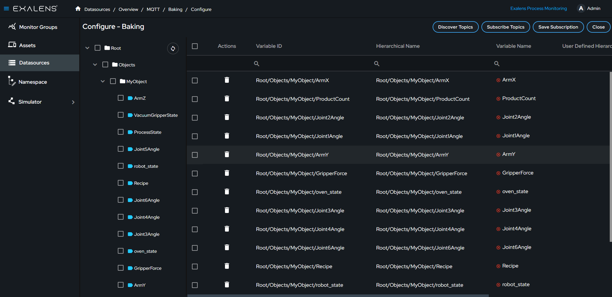

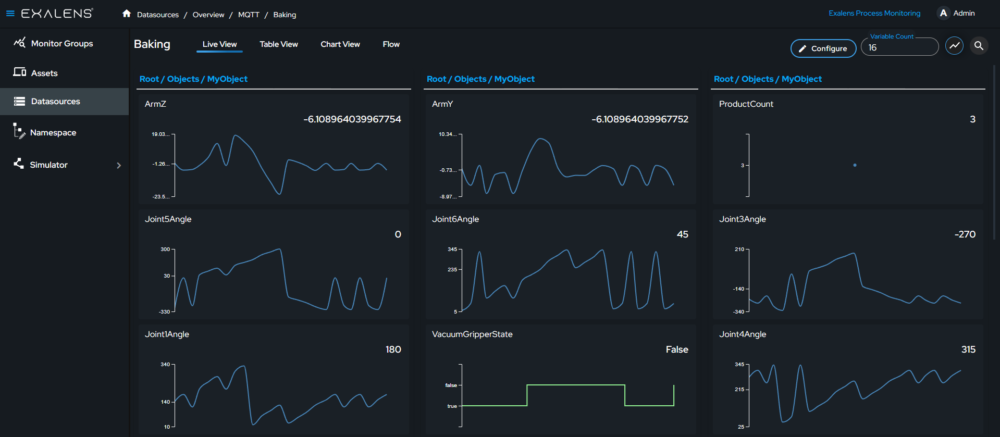

## Visualize

Access the table view to see historical data and recent values. You can filter and export data as a CSV file from this view. The chart view allows you to visualize data trends over time.

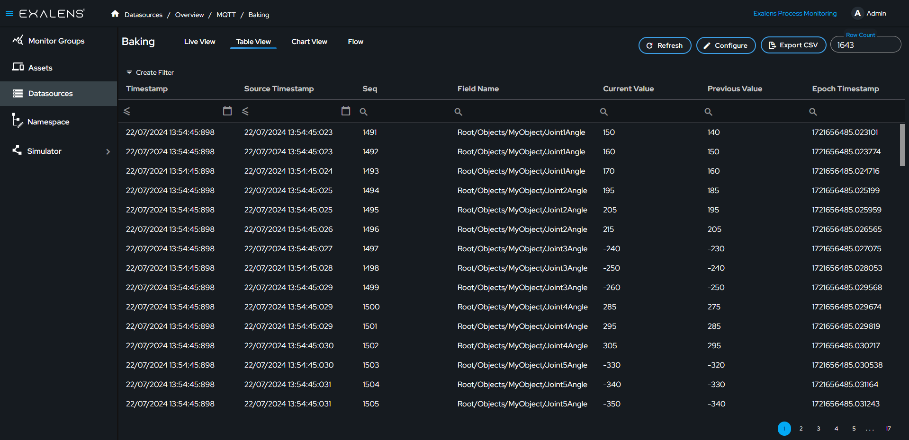

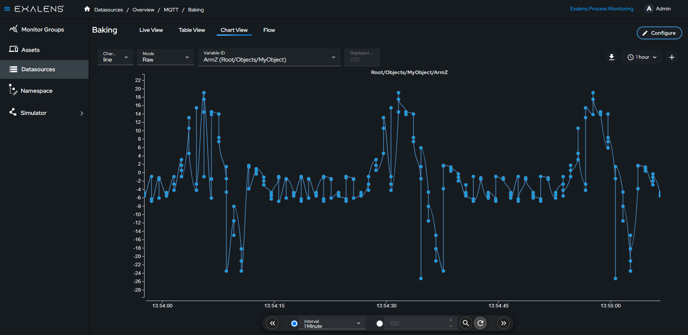
