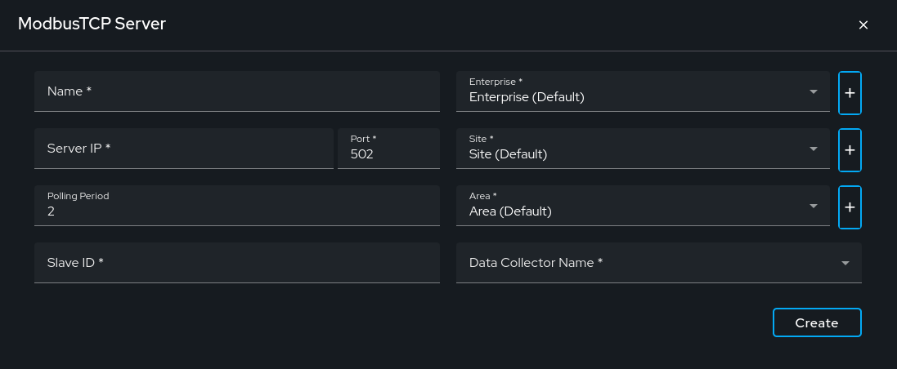

# How to Create a Modbus TCP Data Source Client

This guide provides step-by-step instructions on creating a data source client using the Exalens platform. The client will connect to a Modbus TCP server to collect and store data, which can then be visualized using table and chart views.

## Connect

### Create a New Data Source

1. On the Exalens dashboard, navigate to the "Datasources" section.

   

2. Click on the "Create Datasource" button.

   

### Select ModbusTCP

1. A dialog box titled "Select Datasource" will appear. Choose "ModbusTCP Server" from the list of available options.

   

### Configure the Modbus TCP Server Connection

- **Name:** Enter a descriptive name for the data source, e.g., "Baking".
- **Server IP:** Input the server IP. The default format is `localhost`.
- **Port:** Input the server port. The default port is `502`.
- **Slave ID:** A unique identifier for the Modbus device within the network, used for addressing and communication.
- **Polling Period:** Input the frequency, in seconds, at which the Modbus client queries the server for data updates. The default is `2 sec`.

### Data Collector Name

Selecting the correct Data Collector is crucial. Ensure you choose a Data Collector that has network access to the ModbusTCP server. The client runs on the Data Collector, establishing the connection with the ModbusTCP server. All installed Data Collectors will be listed in the dropdown menu.

   

### Create the Data Source

After configuring the server connection details, click the "Create" button. This action establishes a persistent client connection with the Modbus TCP server. A confirmation message will appear indicating a successful connection. If the connection fails, verify your server IP, port, Slave ID, and network settings, then try again.

   
   
   

## Collect and Store

1. After the data source client is created, click on the data source client. Click on "Configure" to configure the registers.

   

2. Click on the "Update Register" button to add registers.

   
   

3. Select the register type, starting location, and register count as per server configuration. Click on the `+` button to add more.

   

4. Click on the `Submit` button once the required registers are added.

   

Since variables do not have meaningful names, a `User Defined Hierarchical Name` can be added for each variable. The `User Defined Hierarchical Name` can be directly added by editing the field, or you can follow the hierarchy structure to include register type information. For that, select all the variables first and click on `Set User Defined Hierarchical Name`.

   

Select the number of parent levels you want to add and then `submit`.

   

Once submitted, edit the `User Defined Hierarchical Name` field with a meaningful metric name.

   

Setting up a `User Defined Name` is optional. Once registers and all variables are updated, click on "Save Subscription."

   

Upon successful subscription, you will be taken to the live view where you can monitor the live data. The data collected from these subscriptions will be stored in a time series database for further analysis and historical reference. To update or delete any register, you can follow the same procedure.

   

## Visualize

Access the table view to see historical data and recent values. You can filter and export data as a CSV file from this view. The chart view allows you to visualize data trends over time.

   
   
