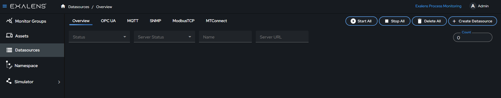
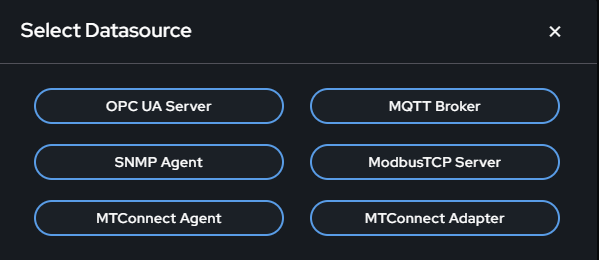
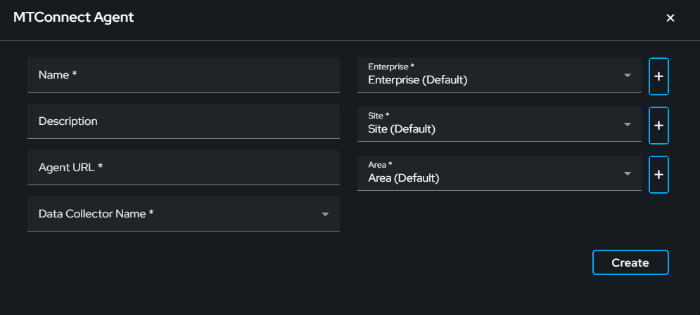
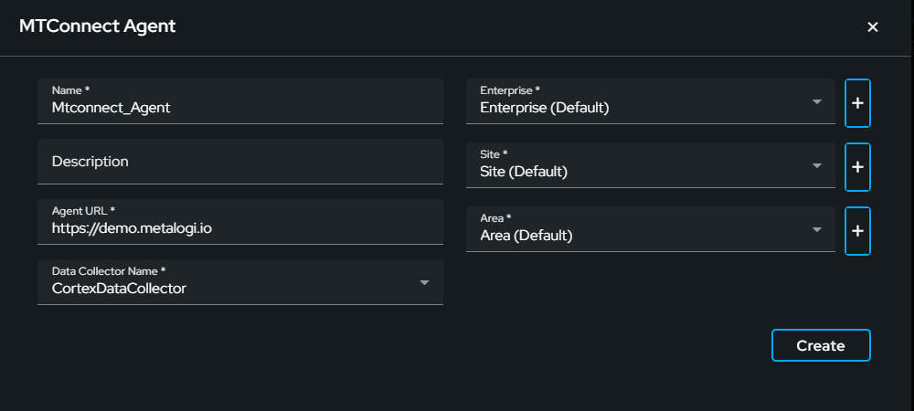
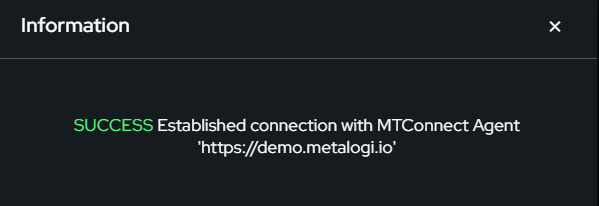
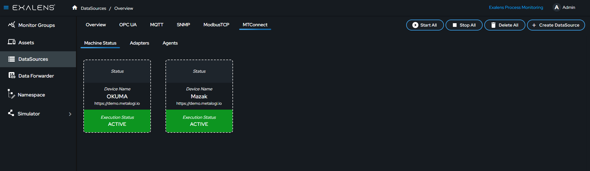
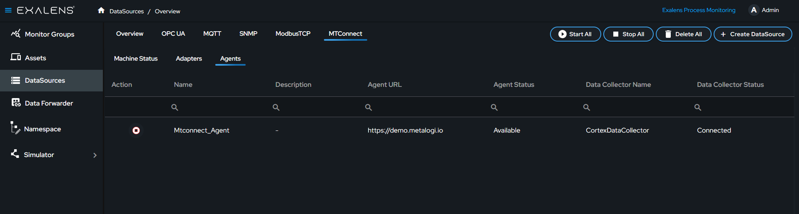
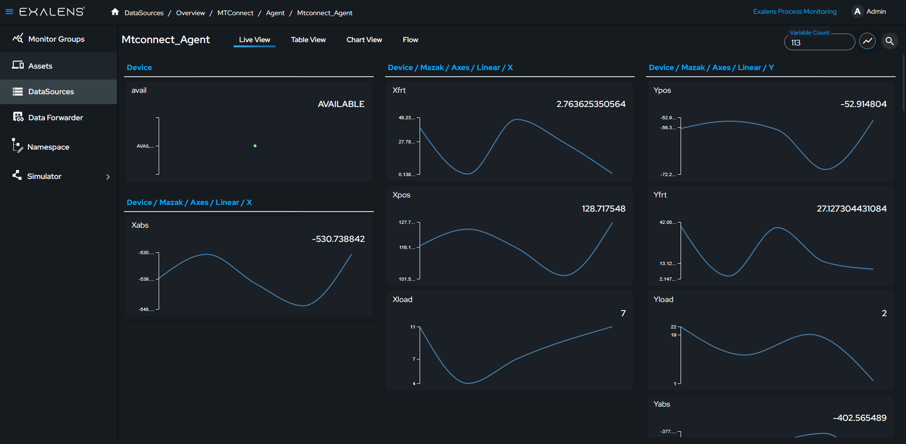
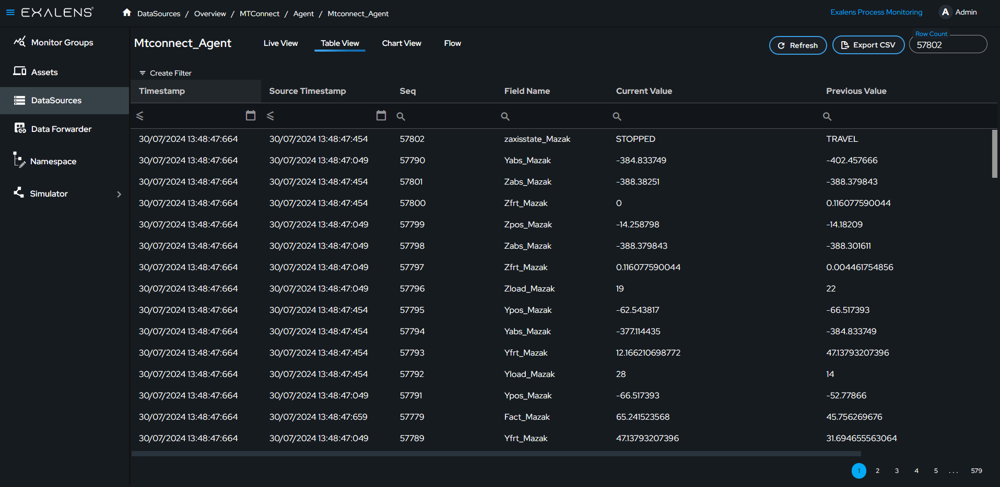
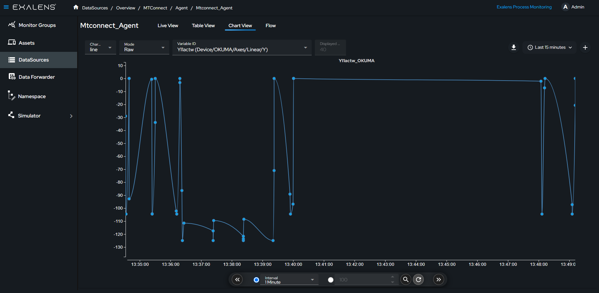

# How to Create an MTConnect Agent DataSource Client

This guide provides step-by-step instructions on how to create a data source client using the Exalens platform. The client will connect to an MTConnect Agent to collect and store data, which can then be visualized using table and chart views.

## Connect

### Create a New Data Source

On the Exalens dashboard, navigate to the "Datasources" section.

Click on the "Create Datasource" button.

### Select MTConnect Agent

A dialog box titled "Select Datasource" will appear. Choose "MTConnect Agent" from the list of available options.

### Configure the MTConnect Agent Connection

Fill in the details for the MTConnect Agent in the provided fields:
- **Name:** Enter a descriptive name for the data source.
- **Agent URL:** Input the agent URL.

### Data Collector Name

Selecting the correct Data Collector is crucial. Ensure you choose a Data Collector that has network access to the MTConnect Agent. The client runs on the Data Collector, establishing the connection with the MTConnect Agent. All installed Data Collectors will be listed in the dropdown menu.

### Create the Data Source

After configuring the agent connection details, click the "Create" button. This action establishes a persistent client connection with the MTConnect Agent. A confirmation message will appear indicating a successful connection. If the connection fails, verify your agent URL and network settings, then try again.

## Collect and Store

After the data source client is created, click on the data source client. You will be taken to the live view where you can monitor the variable's live data. The data collected from these variables will be stored in a time series database for further analysis and historical reference.

## Visualize

Access the table view to see historical data and recent values. You can filter and export data as a CSV file from this view. The chart view allows you to visualize data trends over time.

