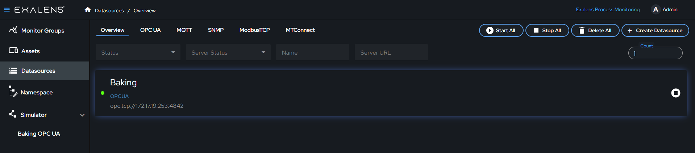
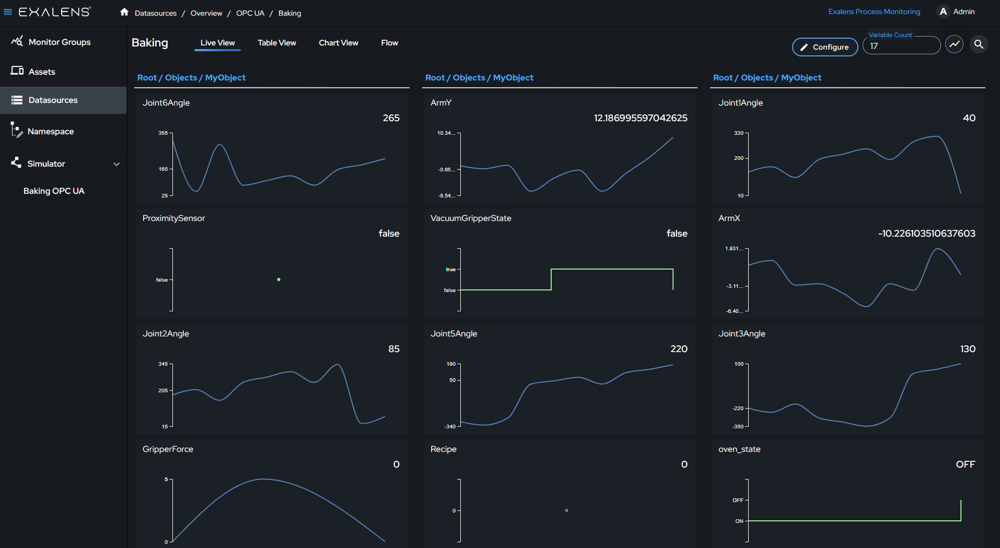

# How to Create an OPC UA DataSource Client

This guide provides step-by-step instructions on how to create a data source client using the Exalens platform. The client will connect to an OPC UA server to collect and store data, which can then be visualized using table and chart views.

## Quick Video Guide

  <iframe 
    width="100%" 
    height="100%" 
    src="https://www.youtube.com/embed/UX-6LI-0gLY?si=xe_DTKzzkvklHubQ" 
    title="YouTube video player" 
    frameborder="0" 
    allow="accelerometer; autoplay; clipboard-write; encrypted-media; gyroscope; picture-in-picture; web-share" 
    referrerpolicy="strict-origin-when-cross-origin" 
    allowfullscreen 
    style={{ position: 'absolute', top: 0, left: 0, width: '100%', height: '100%' }}>
  </iframe>

See below for detailed instructions.

## Connect

### Create a New Data Source

On the Exalens dashboard, navigate to the "Datasources" section.

Click on the "Create Datasource" button.

### Select OPC UA

A dialog box titled "Select Datasource" will appear. Choose "OPC UA Server" from the list of available options.

### Configure the OPC UA Server Connection

Fill in the details for the OPC UA server in the provided fields:
- **Name:** Enter a descriptive name for the data source, e.g., "Baking".
- **Server URL:** Input the server URL. This URL tells the client where to find the OPC UA server. The default format is `opc.tcp://localhost:4840`. Here’s what each part means:
  - `opc.tcp`: This indicates the protocol used.
  - `localhost`: This is the address of the server. "localhost" means the server is on the same machine you are working on. Replace it with the actual IP address if the server is on a different machine.
  - `4840`: This is the port number. Ensure this port is open and accessible. 

### Authentication Methods

**Anonymous**
- Select "Anonymous" under Authentication Methods.

**User Authentication**
- Select "User" under Authentication Methods.
- A dialog box will appear prompting for a username and password.
- Enter the required credentials and click "Submit".

**Certificate and Key**
- Select "Certificate and Key" under Authentication Methods.
- A dialog box will appear prompting for a certificate and a private key file.
- Click "Browse" to upload the certificate file (allowed format: .der).
- Click "Browse" to upload the private key file (allowed format: .pem).
- Click "Submit" to complete the process.

### Data Collector Name

Selecting the correct Data Collector is crucial. Ensure you choose a Data Collector that has network access to the OPC UA server. The client runs on the Data Collector, establishing the connection with the OPC UA server. All installed Data Collectors will be listed in the dropdown menu.

### Create the Data Source

After configuring the server connection details, click the "Create" button. This action establishes a persistent client connection with the OPC UA server. A confirmation message will appear indicating a successful connection. If the connection fails, verify your server URL, authentication details, and network settings, then try again.

## Collect and Store

After the data source client is created, click on the data source client. Click on "Configure" to open the OPC UA folder structure. Browse through the server folders, select the variables you want to subscribe to, and drag them into the subscription list area. Click on "Save Subscription." Upon successful subscription, you will be taken to the live view where you can monitor the live data. The data collected from these subscriptions will be stored in a time series database for further analysis and historical reference.

## Visualize

Access the table view to see historical data and recent values. You can filter and export data as a CSV file from this view. The chart view allows you to visualize data trends over time.

