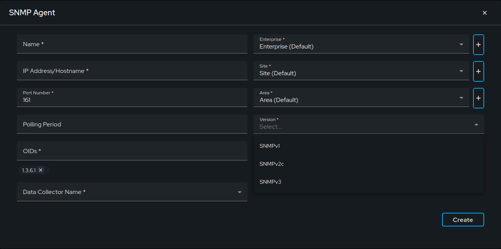
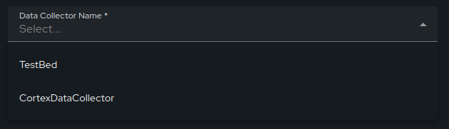
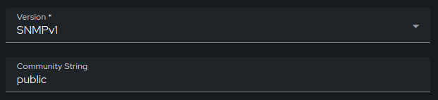
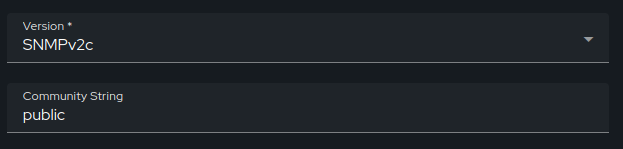
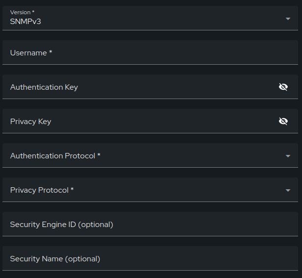
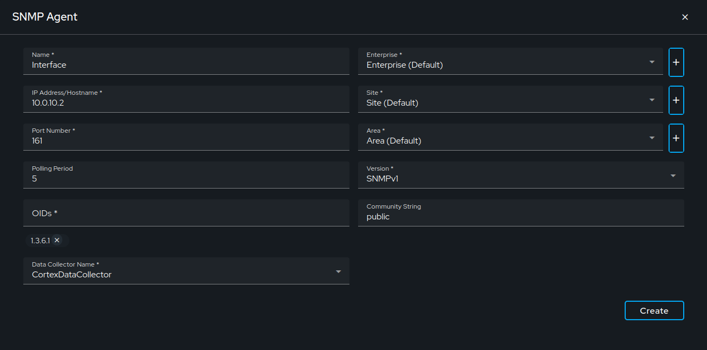
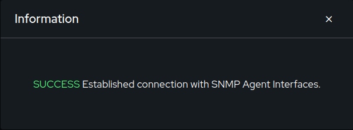
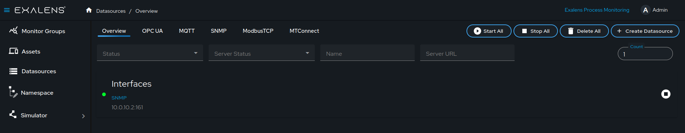

# How to Create an SNMP DataSource Client

This guide provides step-by-step instructions on how to create a data source client using the Exalens platform. The client will connect to an SNMP Agent to collect and store data, which can then be visualized using table and chart views.

## Connect

### Create a New Data Source

On the Exalens dashboard, navigate to the "Datasources" section.

Click on the "Create Datasource" button.

### Select SNMP Agent

A dialog box titled "Select Datasource" will appear. Choose "SNMP Agent" from the list of available options.

### Configure the SNMP Agent Connection

Fill in the details for the SNMP Agent in the provided fields:
- **Name:** Enter a descriptive name for the data source, e.g., "Interfaces".
- **IP Address/Hostname:** Input the Agent's IP address or hostname.
- **Port Number:** Enter the port number; the default is 161.
- **Polling Period:** Set the frequency of data polling by the SNMP agent; the default is every 10 seconds.
- **OIDs:** Enter the metrics you want to monitor. The default OID prefix 1.3.6.1. For faster browsing, specify more precise prefixes like 1.3.6.1.2 for MIB-2,1.3.6.1.2.1.2.2.1.1 for interface information

### Data Collector Name

Selecting the correct Data Collector is crucial. Ensure you choose a Data Collector that has network access to the SNMP Agent. The client runs on the Data Collector, establishing the connection with the SNMP Agent. All installed Data Collectors will be listed in the dropdown menu.

### Version 

Choose the SNMP version used by your SNMP Agent.Options include SNMPv1, SNMPv2c, and SNMPv3, depending on system compatibility.

**SNMPv1**
- **Version:** Ensure that SNMPv2 is selected from the dropdown menu.
- **Community String:** Enter the community string to authorize access.

**SNMPv2**
- **Version:** Ensure that SNMPv2 is selected from the dropdown menu.
- **Community String:** Enter the community string to authorize access.

**SNMPv3**

- **Version:** Ensure that SNMPv3 is selected from the dropdown menu.
- **Username:** Enter the username for SNMPv3 authentication.
- **Authentication Key:** Enter a passphrase that will be used for authentication.
- **Privacy Key:** Enter a passphrase that will be used for encryption.
- **Authentication Protocol:** Select an authentication protocol from the options, typically MD5 or SHA.
- **Privacy Protocol:** Select an encryption protocol, usually DES or AES, to secure SNMP messages.
- **Security Engine ID:** (Optional) Enter the unique identifier for the security engine if required.
- **Security Name:** (Optional) Provide a security name if necessary for additional identification or configuration.

### Create the Data Source

After configuring the server connection details, click the "Create" button. This action establishes a persistent client connection with the SNMP Agent. A confirmation message will appear indicating a successful connection. If the connection fails, verify your server URL, authentication details, and network settings, then try again.

