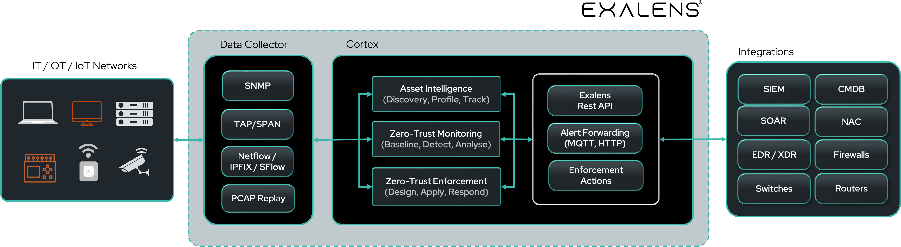

# Exalens Platform Overview

The **Exalens Platform** unifies Zero-Trust network monitoring across all IT, OT, and IoT environments,
revealing, tracking and profiling and enforcing cybersecurity all hidden assets, connectivity and applications. In 4 steps, Exalens
allows organisations to 1) establish full visibility of their assets using flexible, easy to deploy sensors and probes, 2) 
rapidly identify assets and effortlessly track their asset pattern of life, 3) streamline enforcement of Zero-Trust asset policies and 
autonomously anomaly detection that automatically analyses and triages asset alerts, and 4) reduce Mean Time to Respond with automated, 
Zero-Trust asset containment and policy enforcement.

## Summary of Platform Components

The Exalens Platform is installed using lightweight container technology, which enables the platform to be easily deployed on a wide range of hosts, 
whether that is on a bare-metal device or virtual machine, on-premises, in an air-gapped system, or in the cloud. Exalens
provides flexibility for organizations to determine the deployment method that best suits their infrastructure and requirements.

Below the primary components of the Exalens Platform are explained.

### Exalens Cortex
The Exalens Cortex is the core component of the Exalens platform, responsible for performing all data storage, processing 
and analysis of asset network data, including configuration and execution of Zero-Trust asset action response policies. It is also where primary system settings and external tool integrations are configured.

- **Asset Intelligence**: The Asset Intelligence component of Exalens utilises network datasources to continuously observe, and automatically discover, profile and track assets across your IT/OT/IoT networks.
- **Zero-Trust Monitoring**: The Zero-Trust Monitoring component of Exalens records a pattern of life for each asset it is tracking. Asset baselines are used to enforce trusted behaviours for asset identity, and autonomously assess the nature and severity of suspicious or high risk activity exhibited by assets.
- **Zero-Trust Enforcement**: The Zero-Trust Enforcement component of Exalens learns from interactions over time what is trusted and untrusted activity for your assets and their identity, and applies user-defined policies automatically or manually to enforce an asset's Zero-Trust pattern of life or asset containment actions.    
- **Enforcement Actions**: Zero-Trust Enforcement Action integrations with external tools over HTTP(S) and SSH enables Exalens Zero-Trust response actions to be executed on target systems for policy enforcement.
- **Data Forwarding**: Data Forwarding enables integrations with external tools over HTTP(S) or MQTT to forward Zero-Trust alerts for assets.
- **Exalens REST API**: Exalens REST API allows full control from external tool integrations to deploy monitoring, create/update/delete/retrieve asset data, zero-trust monitoring, alerting and enforcement policies.

### Exalens Data Collector (DC)
The DC is responsible for passively monitoring or collecting network traffic flows and datasources, and forwarding these to 
the Exalens Cortex for processing. The DC supports a wide range of network traffic monitoring methods for discovering, 
profiling and tracking asset activity, as follows:

- SPAN / TAP port mirroring
- Netflow / IPFIX / SFlow
- Packet Streaming
- PCAP Replay
- SNMP Probes

The DC self-configures and performs all monitoring locally on the host system it is deployed, with remote configuration instructions received by the Exalens Cortex.
All communication between the DC and Cortex is initiated by the Data Collector, using outbound connectivity only, in a "call-home" method over encrypted TLS connections.
The Cortex does not require direct inbound connectivity to the DC. The DC also comes equipped with an MQTT broker that can receive asset and network information over specific MQTT topics.

When a DC is installed on a host, it is registered and connected to a Cortex. However, by default, the Cortex comes with internal DC when preinstalled, which allows it to be deployed as an all-in-one solution where required.

### Lightweight Client Sensor (LCS)

The LCS is a small application that runs on Linux or Windows devices, and monitors network traffic on local 
interfaces, forwarding a compressed packet stream or periodically sending compressed PCAP files to a target DC over TCP. Once received
by a DC, the DC replays in real-time the packet stream or PCAP to its internally Deep Packet Inspection (DPI) engine to 
generate network logs that are forwarded to the Exalens Cortex for processing.

## What's in this Guide

In this user guide, installation, system administration, configuration and features overview instructions are provided. Should you require further information and support, or spot any inconsistency
in the information provided, please contact Exalens via email on team@exalens.com.