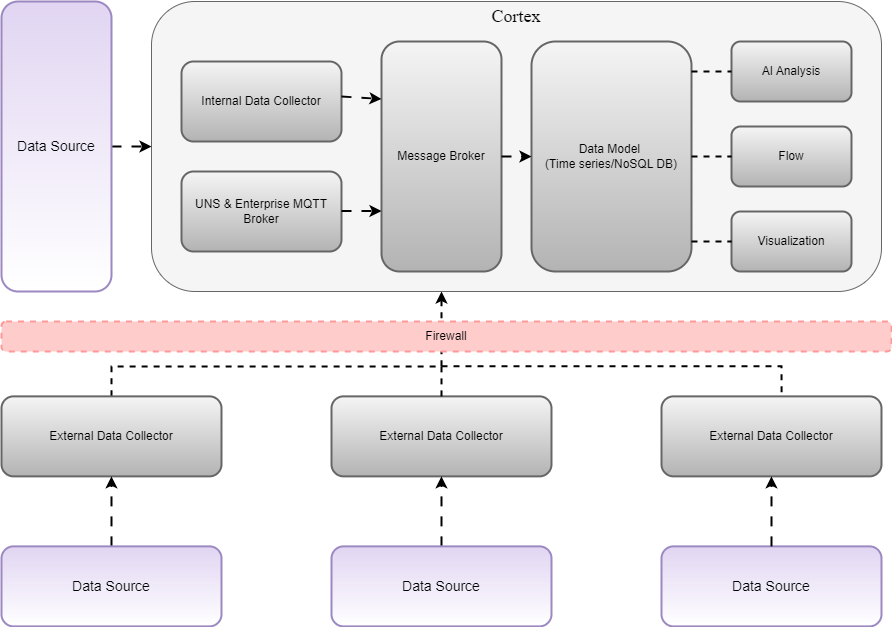

# Exalens Platform Overview

The **Exalens platform** simplifies the task of unifying **data collection, enrichment**, and **AI-powered** analysis with the click of a button, empowering rapid, data-driven decisions from engineers to C-level executives.

## Platform Components

### Cortex
The Exalens Cortex is the core component of the platform, responsible for managing and orchestrating various processes. It integrates data from multiple sources through Data Collectors, acts as the central storage repository, and supports UI interactions to respond to user queries efficiently. It can be deployed on-premises or in the cloud, providing flexibility depending on organizational needs.

#### Key Components of Cortex

- **Message Broker**: Facilitates communication between different components within the Exalens Platform, ensuring smooth data transmission from the data collectors to the data model and other processing units.
- **Enterprise MQTT Broker**: Collects data from external sources through MQTT protocols, integrating data from various systems and devices into the platform. Acts as a unified namespace, ensuring a single source of truth, real-time updates, and a comprehensive view of all data points.
- **Data Hub**: Efficiently stores and manages collected data using time-series and NoSQL databases, simplifying data navigation. Allows users to build customized data models tailored to their specific needs.
- **AI Analysis**: Leverages machine learning algorithms and custom models to extract meaningful insights and patterns, establishing a baseline for process behavior. Continuously tracks production processes, enabling the detection of deviations and anomalies, prediction of outcomes, and timely decision-making.
- **Flow**: Performs data engineering tasks using pipelines to transform data and generate KPIs. These KPIs are stored in the data model and published to the unified namespace. Supports data cleaning, aggregation, and enrichment and enables DataOps by automating workflows and ensuring data quality.
- **Visualization**: Provides tools to display data graphically, making it easier to understand. Offers customizable dashboards, charts, and tables for real-time and historical data. Users can filter and aggregate data in charts, identify patterns, track performance, and make informed decisions. Interactive features allow users to explore specific data points and compare datasets for deeper insights.
- **Internal Data Collector**: Cortex comes with an Internal Data Collector. It has the same capabilities as the External Data Collector but does not include an Edge MQTT broker because the Internal Data Collector is launched on the same host as the MQTT Enterprise Broker, eliminating the need for it.

### Data Collector
The Data Collector is responsible for gathering data from various sources. It supports multiple protocols, including OPC UA, MQTT, Sparkplug B, Modbus, SNMP, and MTConnect. It sends the collected data to the Cortex via the broker, ensuring comprehensive data collection and seamless integration for analysis.