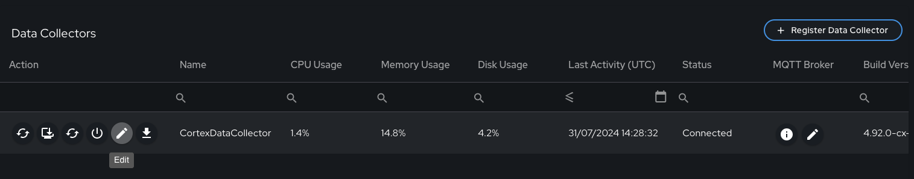

# Network Monitoring

## Introduction

The guide will provide information on how to set up passive network monitoring on your Exalens installation, using external Exalens Data Collectors, or the internal Exalens Cortex Data Collector.

## Configuring Network Monitoring
To enable passive network monitoring, at least one Exalens DC must be configured with a “Monitoring Interface” which configures the DC to activate its Deep Packet Inspection (DPI) engine for a specific network interface on the host in which the DC is installed, and start collecting and analysing packets from this interface. Once configured, the DC will begin generating and forwarding network logs to the destination Exalens Cortex for storage, processing and analysis.

Configuring a “Monitoring Interface” on a DC is straightforward, however, before configuration atleast one network interface on the DC host should be selected and available for the DC to configure as a "Monitoring Interface" and activation of passive monitoring of network traffic received on this interface.

## Passive Network Monitoring via TAP, SPAN, or On-Host

When setting up passive network monitoring it is important to consider how packet capture will implemented. Typically, there are three methods for passive monitoring using an Exalens DCP, as listed below:

- **Network TAP**: A network TAP (Test Access Point) is a device that connects directly to the cabling infrastructure between two network devices, monitoring all data flows through the TAP. Using an internal splitter, the TAP creates a copy of the data for monitoring while the original data continues unimpeded through the network. A DC can be configured to receive packets from any TAP device by connecting its monitored interface to the TAP device interface that is forwarding copied capture packets.

- **Network SPAN port**: A SPAN port (sometimes called a mirror port) is a software feature built into a switch or router that creates a copy of selected packets passing through the device and sends them to a designated SPAN port. Using software, the administrator can easily configure or change what is monitored. A DC can be configured to receive packets from any SPAN-capable device by connecting its monitored interface to a device’s SPAN interface configured as a mirror port.

- **On-Host DC**: A DC can be deployed on any Linux device to monitor the interface(s) of that Linux system and forwarding network logs to a Exalens Cortex. On-host DC deployments are only recommended for Linux hosts with at least 16GB RAM and 8-core CPUs.

An illustrative example is provided below:

## Adding Monitor Interfaces via the Cortex UI
Configuration of a network monitoring interface on a DC is carried out under "System Administation" on the Cortex UI. 

Navigating to "System Administration" and selecting the "Data Collectors" menu tab shows which DCs are available on the system. 

Selecting the "Edit: button for a DC allows for adding a monitoring interface. **Important:** The name of the monitoring interface should match exactly how it appears on the DC.

When network monitoring interfaces are added on the DC configuration, the Cortex will notify the DC to begin monitoring network traffic on the specified interface (note this can take a few minutes to start collection). After updating the DC configuration, if the newly configured interface is not available there may be no errors or warnings generated. You can validate network monitoring is correctly functioning by reviewing the network logs under Network Monitoring - Logs, selecting the “Conn” log and filtering the logs by the DC “Probe Name” field to see if traffic is being received by the Cortex from the DC on the desired interface. See the example below: 

## Setting Network Interface to Promiscuous Mode
To enable fully passive monitoring of an interface on a host that allows the host to process all packets received by an interface, promiscuous mode must be enabled on the interface. To configure promiscuous mode on a network interface, run the following command:

'''sh
./retina-datacollector.sh --set_promisc
'''

This command lists all available network interfaces for selection as a monitoring interface. The user selects which interfaces to set to promiscuous mode for network monitoring. Do not select the DC interface used to communicate with the Cortex, as this will break the connection between the DC and Cortex, therefore, for on-host DC deployments in Linux devices, promiscuous mode should not be set.

## Setting up a Monitoring Interface with a Secure Monitoring Configuration
Exalens makes available a number of command line utility tools for network monitoring and command-line PCAP uploads. These utility tools can be accessed by download the utilities repository from Exalens Github here: [Exalens Utilities on Github](https://github.com/exalens/utilities).

In the utilities folder, the script "set_netmon_interface.sh" enforces a secure monitoring configuration which prevents any inbound or outbound IPv4/IPv6 packets or outbound Ethernet frames being transmitted from a monitoring interface. Executing this script configures an interface with the following interface controls:

- Enforcement of Promiscuous mode
- IPtables block for inbound and output IPv4 and IPv6 packets
- EBTables block for outbound Ethernet frames
- Disabling of interface Broadcast, Multicast, and ARP

When running the script use sudo permissions and provide the interface name to configure when prompted, choose whether the interface is Wireless or Wired, and choose "set" to enforce the configuration or "remove" to remove the configuration. See example below:

'''
~/utilities$ sudo ./set_netmon_interface.sh 
Enter the interface name: replay
Is this a Wi-Fi interface? (yes/no): no
Would you like to set or remove the monitoring configuration? (set/remove): set
Monitoring configuration successfully set for replay (wired)
'''

## Uploading PCAP files
Using any DC it is possible to upload and process PCAP files by replaying them against any DC monitoring interface. Currently, this feature is only available via the command terminal using the utility script “upload_pcap.sh”. This script can be found under the utilities folder on the DC host it was downloaded to. 

**Note:** Prior to running the "upload_pcap.sh" script, tcpreplay will need to be installed on the DC host. Use the following command to install tcpreply:

'''
sudo sudo apt install tcpreplay 
'''

It is recommended that a dedicated dummy software interface is created on the DC for replaying PCAP files. Similar to setting up a monitoring interface for live network packet capture, a PCAP file can be uploaded via a DC using a dummy software interface for PCAP file processing. This process is straightforward using the "create_dummy.sh" utility script in the utilities folder. As described in the previous section, under “System Administration - Data Collectors” the dummy software interface should be enabled for monitoring under the respective DC, using the “edit” button for the DC in the Data Collectors tab.

Once the dummy interface has been created and configured as a monitored interface under the DC, the “upload_pcap.sh” utility script in the utilities folder should be used to upload a PCAP file via the DC. Run the scrip with sudo permission, when prompted the PCAP file name, interface to perform the PCAP replay (your dummy software interface, or any other interface you wish to you), and the speed in Mbps in which you wish to perform the replay. Once the PCAP is uploaded the following PCAP upload results will be displayed on the terminal. See example below:

'''
~/utilities$ sudo ./upload_pcap.sh 
Enter the path to the PCAP file: snmp.pcap
Enter the interface name for PCAP replay: replay
Enter the PCAP replay bandwidth (e.g., 50Mbps): 10Mbps
Uploading PCAP file...
PCAP upload started: 2024-07-31 15:09:16.778469 ...
PCAP upload completed: 2024-07-31 15:09:16.850959
Actual: 1020 packets (90612 bytes) sent in 0.072490 seconds
Rated: 1249993.1 Bps, 9.99 Mbps, 14070.90 pps
Flows: 2 flows, 27.59 fps, 1020 flow packets, 0 non-flow
Statistics for network device: replay
        Successful packets:        1020
        Failed packets:            0
        Truncated packets:         0
        Retried packets (ENOBUFS): 0
        Retried packets (EAGAIN):  0
PCAP upload completed successfully.
'''

Confirmation of the successfully processed PCAP can be conducted by navigating to “Network Monitoring - Logs” and checking whether network log data is appearing in expected log files. Connection logs always appear in the “conn” or “conn_long” log. You can filter by the DC name using the field “probe_name” in the log table “move column left” filter to only look for logs generated from the specific DC in which the PCAP file has been uploaded. See example below:

## Generating Network Baselines

Network baselines are a powerful feature in Exalens that allows users to define a specific period in which the Exalens Cortex will baseline all network connectivity from network logs it is receiving for DCs. Baselines are used to generate network intelligence that enables Exalens' underlying detection engine to detect abnormal system activity, by populating specific device, user, and detection indicator databases which users can also interrogate in the form of lookups.

Creating a network baseline is optional, and certain high-risk, suspicious, or cyber-hygiene activities do not require network baselines for detection and alerting. However, Exalens' detection engine relies on network baselines to detect rare or abnormal network and system activity. A network baseline allows Exalens to model anomaly indicators which use historic system activity to compare with normal expected system behaviour. It is important to remember that some detections will not function without a network baseline. Detections that function without a network baseline, but contain indicators that rely on a network baseline, will not activate any baseline-dependent indicators for detection analysis.

To create a network baseline, navigate to “Network Monitoring - Configure” and select the “Baseline the Network” tab. 

A new network baseline can be initiated by clicking the “Baseline” button and selecting the desired period to baseline, as well as a description of the baseline. 

Once a baseline has been initiated, it can be stopped by selecting the stop button in the baseline table. Note that this will retain any network baselining carried out from the start of the baseline until it is manually stopped. Once the baseline is completed, subsequent baselines will automatically update the existing network baseline. 

## Network Lookup Intelligence

Once network monitoring is enabled, the Exalens system will automatically populate network intelligence lookup databases. Network intelligence lookups are used by the Exalens Cortex detection engine for carrying out detection analysis, for example, with specific lookups supporting the generation of detection indicators. These looks are also available for end users to interact with and use as telemetry for various analysis tasks, such as preventative risk assessment or proactive alert and threat hunting investigations. 

Network lookups are populated automatically and continuously during live networking interface monitoring and via manual PCAP uploads. End users can also manually interact with network lookups, by deleting or uploading new lookup entries via the “Lookups” user interface page, or via the App API. The example below provides a view of a lookup table for “Endpoint Device Intelligence”.

In the tables below the list of lookup categories and corresponding lookups are provided - the availability field shows whether the lookups are available to see via the user interface on the Exalens Cortex, or whether the lookup is currently unavailable in the system.

|**Incident Intelligence**|**Status**|
|:--|:--|
|DCE-RPC seen in incidents|Available|
|Destination IP(s) seen in incidents|Available|
|Destination Port(s) seen in incidents|Available|
|Detection Label seen in incidents|Available|
|SSH Client Fingerprints (HAASH) seen in incidents|Available|
|Sensitive SMB activity seen in incidents|Available|
|Source IP(s) seen in incidents|Available|
|TLS Client Fingerprints (JA3) seen in incidents|Available|
|TLS Server Fingerprints (JA3S) seen in incidents|Available|
|User Agents seen in incidents|Available|
|Sensitive Files seen in incidents| Not Available|
|Suspicious Files seen in incidents| Not Available|

|**DNS Intelligence**|**Status**|
|:-|:-|
|DNS to Hostname Mapping|Available|
|Private DNS Servers|Available|
|Public DNS Servers|Available|
|Root Domains Accessed|Available|

|**Endpoint Device Intelligence**|**Status**|
|:--|:--|
|Device User Agents|Available|
|Internal Connectivity Paths|Available|
|Network to Hostname Mapping|Available|
|SMB Activity|Available|
|SSH Client Fingerprints (HASSH)|Available|
|TLS Client Fingerprints (JA3)|Available|
|Username usage by source and destination|Available|
|Windows RPC Activity|Available|

|**OT Protocol and Communication Intelligence**|**Status**|
|:--|:--|
|BACNet|Available|
|BSAP over Serial|Available|
|BSAP over IP|Available|
|CC-Link IE Control|Available|
|CC-Link IE Field|Available|
|CC-Link IE Field Basic|Available|
|CIP|Available|
|DNP3|Available|
|EtherCat|Available|
|EtherCat over AOE|Available|
|Ethernet/IP|Available|
|GENISYS|Available|
|KNX|Available|
|MODBUS|Available|
|OPC UA|Available|
|OMRON FINS|Available|
|PROFINET DCE-RPC|Available|
|PROFINET Function|Available|
|S7COMM|Available|
|S7COMM Plus|Available|
|Synchrophasor|Available|

|**Safe Domain(s) / IP(s)**|**Status**|
|:--|:--|
|Domains|Available|
|IP Addresses|Available|

# Passive Asset Discovery, Profiling and Tracking

When network monitoring is enabled in an Exalens product, the system will automatically begin discovering, profiling and tracking assets based on their IP address, MAC address and hostname. This asset discovery and tracking feature builds a rich inventory of system assets communicating over the network, that enables end users to gain the following insights:
 

- Understand what assets exist across their environment
- How and when assets are communicating, what network services they host and access
- Understand different asset roles, device profiles, criticality in the network and their potential threat exposure
- Unique asset fingerprints, as well as identification of similarities between assets based on their peer behaviours in the network
- Identify which user accounts have been used on an asset and when

In addition to this asset information, the Exalens platform utilises asset information for threat and anomaly detection by leveraging rich asset context learned from DPI network analysis to inform and prioritise detection and alert risk. By default, users do not need to set any configuration for passive asset discovery, profiling or tracking as it is automatically activated once network monitoring is enabled and start receiving network logs from an Exalens DC. **Note:** Asset discovery, profiling and tracking updates are performed every 15 minutes.

A detailed overview of Asset Discovery and Intelligence features is provided in [Asset Discovery and Intelligence](./asset_intelligence.md).

## Network Protocol Support List
Across Exalens' product portfolio, Deep Packet Inspection (DPI) protocol decoding and log generation are currently supported for the network protocols and suites listed in the table below. **Note:** The Exalens platform can monitor any IT/OT protocol at connection flow level. However, if you require specific DPI monitoring contact the Exalens support team via email: support@exalens.com or Slack if a network protocol you require DPI support for is not listed below, as it may be disabled in your Exalens distribution. Exalens is committed to providing extended support for IT/OT and vendor-proprietary protocols. Where network protocol is not currently available, a feature request can be made to our development team for enablement in future releases. 

In the table below, current DPI support for IT and OT protocols is provided: 

|**OT / ICS Protocols**|**IT Protocols**|
|:--|:--|
|Modbus TCP|DNS|
|Siemens S7COMM|mDNS|
|Siemens S7COMMPlus|SSDP|
|OPC-UA|DHCPv4|
|DNP3|DHCPv6|
|BACNet|MQTT|
|ENIP|ICMP|
|CIP|SNMP|
|PROFINET|SMB (Version 1, 2, 3)|
|COTP|SSL / TLS|
|BSAP|LLDP|
|CC-Link|LDAP|
|KNX|HTTP|
|GENYSIS|HTTPS|
|Omron FINS|RADIUS|
|Synchrophasor|SMTP|
||POP3|
||NETBIOS|
||MYSQL|
||SIP|
||SOCKS|
||Telnet|
||RDP|
||VNC|
||SSH|
||FTP|
||TEREDO|
||GRE|
||STUN|
||LLMNR|
||NTLM|
||KERBEROS|
||NTP|
||SYSLOG|
||RSVP|
||TFTP|
||OSPF|
||IPSec / IKE|
||Wireguard|
