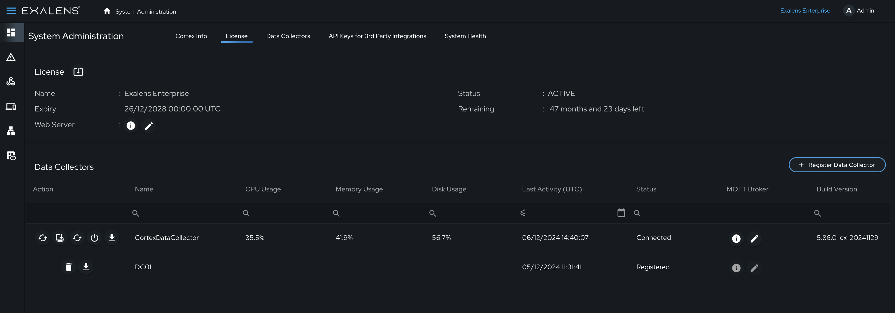
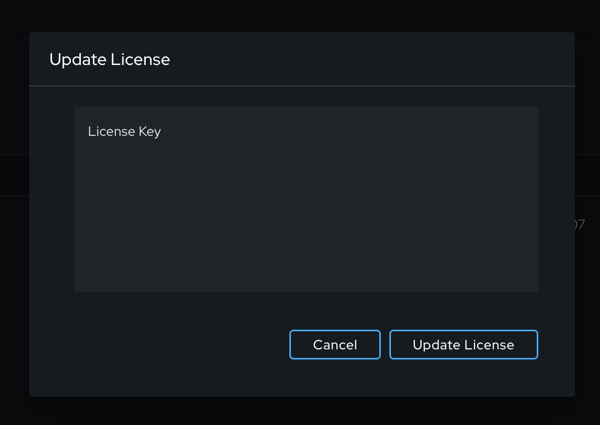
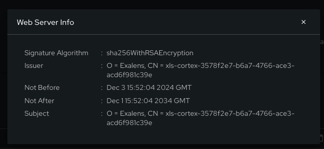
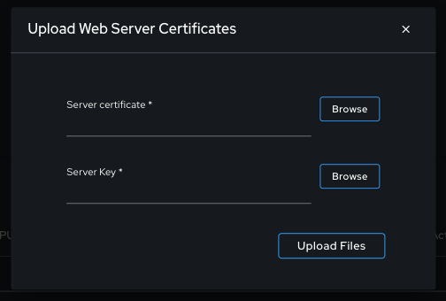
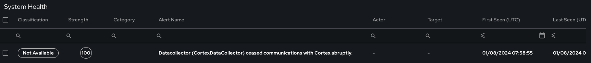
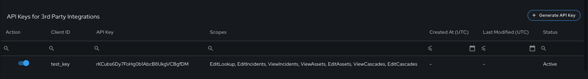
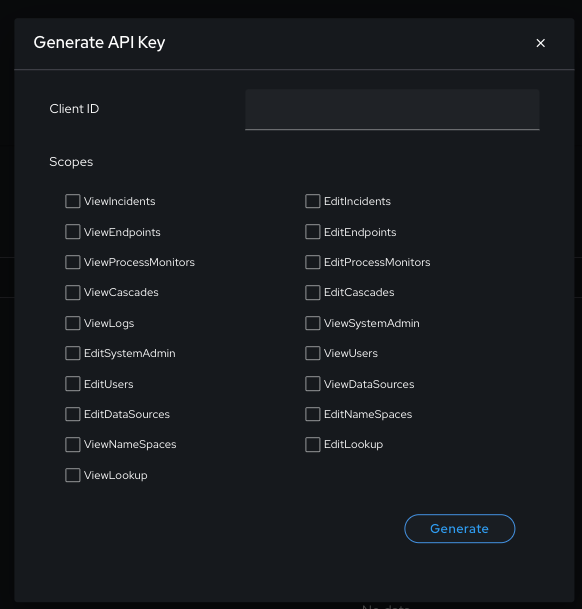

# System Administration

## Introduction

The guide will provide information on how to configure and use System Administration settings on your Exalens Cortex.

## Add / Update Exalens License

On first login after installation, the Exalens Cortex generates a license input prompt. However, the license may be updated at any point after initial login for example to replace an expired license or add a license that has new entitelements.
To add a new license to the Exalens Cortex, under System Administration, select the "License" tab, under this tab, next to the tab name select the "Upload" button, as shown below:

Once selected, an "Update License" configuration pop-up window will appear where a new license key can be supplied. On providing a new valid license, the Exalens Cortex may restart the Exalens Web UI and backend services, this may cause a temporary delay in being able to access the Exalens Web UI and result in a few minutes of inactivity whilst the services reload. 

Once reloaded, the Exalens Cortex can be accessed and any existing and new services / entitlements related to the license will be available. 

## Cortex HTTPS Certificate

By default, when installating the Exalens Cortex a self-signed HTTPS certificate is generated for the accessing the Exalens Web UI.
This self-signed certificate may generate certificate validation failure warnings when accessing the Exalens Cortex UI via a web browser. Whilst the warning can be accepted and the Web UI thereafter accessed, it is also possible to uploaded a trusted HTTPS certificate to the Exalens Cortex.

The Exalens Cortex does not provide the means to create a trusted certificate itself, however, by following a standard certificate request process (e.g., https://www.digicert.com/kb/csr-creation.htm), and generating a certificate signed by a trusted certificate authority, under the System Administrator menu, this certificate can be uploaded for use in the Exalens Web UI.

As shown in the figure below, in the System Administration menu under the "License" tab, the Web Server information and pencil icons can. 

The information button provides information about the currently installed HTTPS web certificate, as shown below:

The pencil ("Edit") button generates a pop-up configuration menu to upload a new HTTPS web certificate, as shown below:

## Cortex Health Alerts

Alerts are generated in the Cortex under the "System Health" tab whenever Exalens Data Collectors unexpectedly disconnected from the Exalens Cortex. Disconnection can occur from a number of reasons, some expected (such as reset the Exalens Cortex and/or Exalens Data Collector(s)), and some unexpected (such as a network or software fault).
Whenever a disconnection event occurs that is not expected, an alert will be raised under System Health to indicate this event for any further investigation. 

**Important**: All other Exalens Cortex and Data Collector logging (Informational to Debug) is recorded under directory ".exalens/retinaCortex/logs" for the Exalens Cortex or ".exalens/retinaProbe/logs" for the Exalens Data Collector. These logs provide low-level audit records and information related to normal system behaviour as well as any software faults or misconfiguration that have occurred. As such as they are vital resource for helping investigate any issues in the performance of the Exalens platform. 

## Generating an API key to use with Third Party applications and integrations

To integrate Exalens with external, third-party applications, an API key can be created to interact with Exalens App API (more details on the API can be found in the App API section.).
To create an API Key simply navigate to the tab "API Keys for Third-Part Integrations" under System Administration and select the "Generate API Key" button on the right hand corner of the UI.

Once select, a pop-configuration menu will appear with configuration inputs for the API key Client ID and API authentication scopes as shown below.

Once the Client ID is provided and API scopes are selected, the API can be created and used for authenticating and interacting with the Exalens App API. More details on use API scopes and the Excalens App API RESTful API capabilities are provided in detail under the "App API" section.

