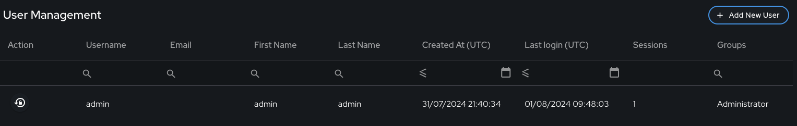
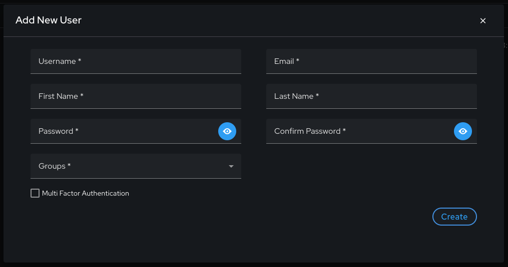
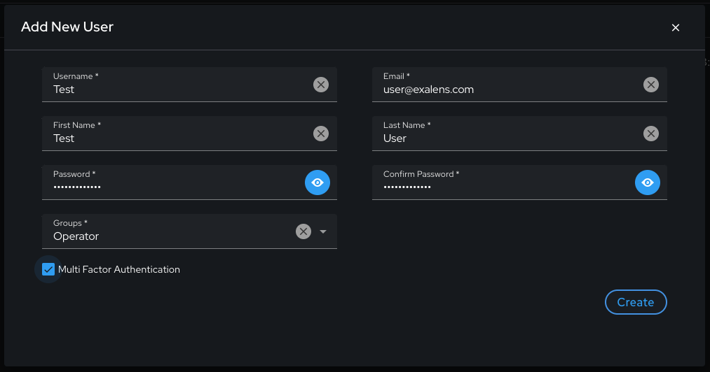
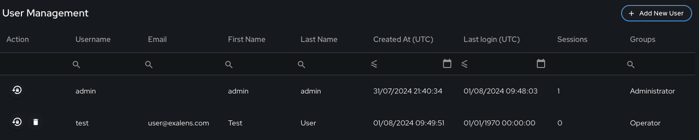
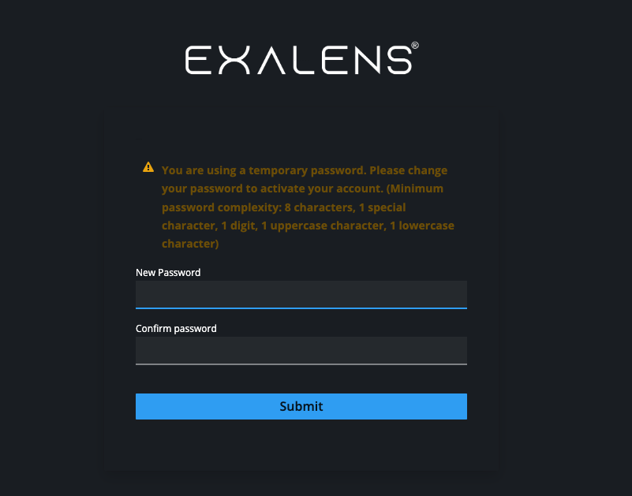
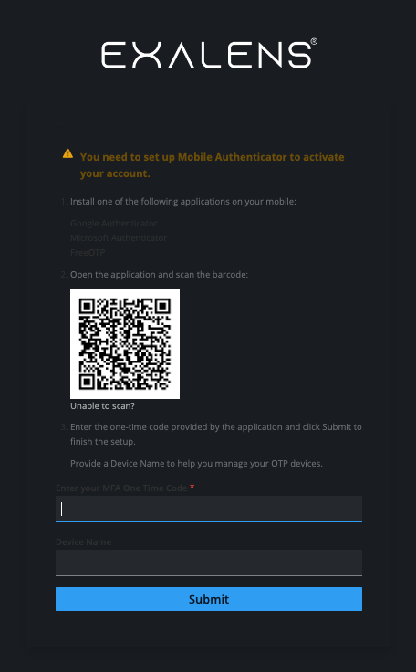
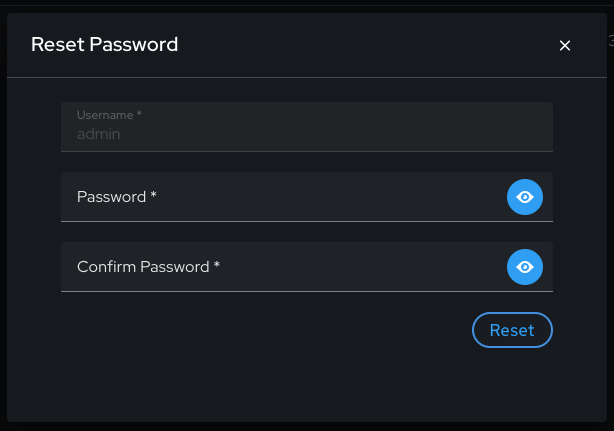
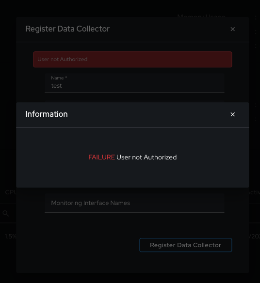

# User Management

## Introduction

The guide will provide information on how to configure and use User Management settings on your Exalens Cortex.

## User Management in Exalens

In the Exalens platform, User Management can be carried out via clicking on the top right hand icon in the Web UI with the Username displayed and selecting "User Management".
The user management UI provides a simplified set of configuration parameters for creating/updating user accounts and assigning role-based permissions to this accounts, as well as Multi-Factor Authentication (MFA) settings.

Shown below is the default view of the user management interface showing the default administrator user account. 

## Add / Update Users

To add a new user account, the "Add New User" button situation in the top right of the UI can be selected. Selecting this button will generate a pop-up configuration menu as shown below:

In the user account configuration parameters, the role of the user can be selected under "Groups", where the options are "Administrator" or "Operator". These groups are role-based groups which determine the level of read/write access the user account has within the Exalens Cortex. Note that currently these are the only two role-based access groups that can be selected from.

The "Administrator" group has full read/write access to all feature within the Exalens Cortex, whereas the "Operator" group has only read access to the features in the Exalens Cortex.

MFA can be optionally enabled when creating the user account, and if selected, will be setup during the initial login to the newly created user account.

Once a new user has been created, the account will appear in the list of users on the user management UI, as shown below:

On first login to the newly created user account, a password reset will be required and is prompted, as shown below:

If the MFA user account setting as enabled during user account created, completion of the MFA setup will follow successful update of the user account password, as shown below:

Once MFA setup is completed, in subsequent logins, after providing the username and password for Cortex Web UI login, the MFA One-Time Pad (OTP) Challenge request will be generated, and the user must supply the OTP code from their selected authneticator software to pass the MFA challenge and successfully complete the login.

Passwords for existing user accounts can be easily updated by selecting the password reset button under the "Action" column for the respective user account in the user management UI. On selecting this button, a pop-up configuration menu will appear prompting for input of the new password for the user account.
Once successfully entered this will change the password for the user account.

As discussed previously, if a user account has been created with the "Operator" group, and therefore only granted read permissions on the Exalens Cortex, should the user account be used to attempt a "write" account on the Web UI, and permissionserror shown below will appear stating that the user account is not authorised to perform the requested action:

